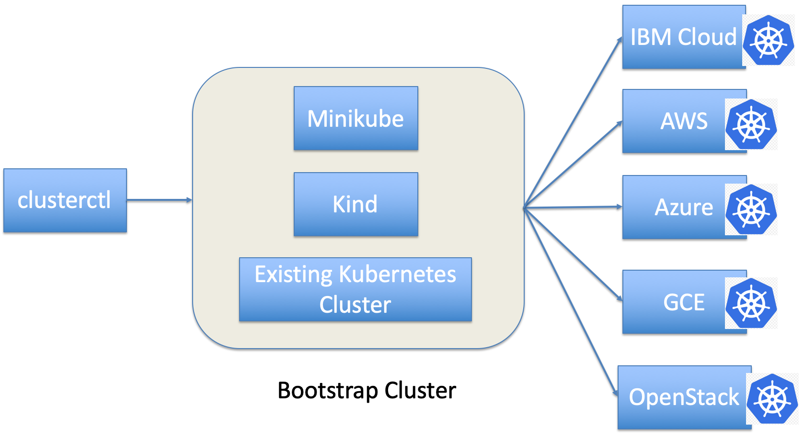

# 集群 API：以 Kubernetes 原生方式管理 Kubernetes 集群
多家云供应商采用的 Cluster Management API 如何帮助您管理自己的 Kubernetes 集群

**标签:** API 管理,Kubernetes,容器

[原文链接](https://developer.ibm.com/zh/articles/cluster-api-manage-your-kubernetes-cluster-in-a-kubernetes-way/)

Guang Ya Liu

发布: 2019-06-05

* * *

## 背景

在去年的 KubeCon 上海会议和 KubeCon 西雅图会议期间，部分主题演讲传递出这样一种讯息：即 Kubernetes 正变得越来越“无趣”，但在我看来，Kubernetes 却是越变越“成熟”。

Kubernetes 生态系统的不断发展促进了 Kubernetes 的成熟，比如，如今的开发者们正在尝试通过在 Kubernetes 的基础上运行更多服务，不断开拓进取。这意味着 Kubernetes 如今已日渐成为集成引擎和创新平台，在 Kubernetes 生态系统中，目前正不断涌现出像 Kubeflow for Machine Learning、Knative for Serverless、Istio for Service Mesh 之类的新服务。更不用说许多开发者还尝试将其应用程序扩展至各种环境了：混合云、多云 Federation V2、多云环境、Edge Cloud 和 Rancher K3S 等等，不一而足。

不断发展的 Kubernetes 生态系统还意味着开发者们正越来越普遍地使用 Kative 方法解决基于部分 CRD 和控制器（如集群注册表、Federation V2、Kubernetes Operator）的新需求。利用此 Kubernetes 原生方式，开发者可以更轻松地与基于 Kubernetes 而构建的新服务和功能保持步调一致。

Cluster Management API 简称为 Cluster API，它正是在这种情况下诞生的。对于混合云和多云环境，我们需要使用 Kubernetes 原生方式来帮助用户管理（创建/删除/添加节点/删除节点）不同云提供商的 Kubernetes 集群，如 AWS、Azure、GCE、OpenStack 和 IBM Cloud™。

## Cluster API 简介

Cluster API 是一个 Kubernetes 项目，它使用 Kuberentes 原生方式来创建、配置和管理集群。它可在 Kubernetes 核心的基础上提供可选的附加功能。

Cluster API 可被视为通用的 Kubernetes 集群管理框架，但您可能想要基于 Cluster API 实施自己的云提供商服务。现在有许多不同种类的云提供商都以 Cluster API 为基础，如 AWS、Azure、GCE、OpenStack 和 IBM Cloud。您可从 [此处](https://github.com/kubernetes-sigs/cluster-api#provider-implementations) 获取云提供商的完整列表。

您也可以参阅 [what-and-why-of-cluster-api](https://blogs.vmware.com/cloudnative/2019/03/14/what-and-why-of-cluster-api/)，更详细地了解为何开发者需要使用 Cluster API。

## 使用 cluster-api-provider-openstack

cluster-api-provider-openstack 是面向 OpenStack 的 cluster-api 的云提供商实施。我将向您展示一些有关其处理方式的步骤。

当前可采用三种方式通过 Cluster API 来配置 Kubernetes 集群 – 可使用 Minikube、Kind 或现有 Kubernetes 集群。我们鼓励您使用 Kind 或者现有的 Kubernetes 集群，因为这两种方式速度更快。接下来，我将向您展示使用 Kind 或现有 Kubernetes 集群来配置 Kubernetes 集群的步骤。



## 前提条件

- 安装 `kubectl`
- 安装 Kind。如果目前没有 Kubernetes 集群，可参阅 [Kind 安装文档](https://github.com/kubernetes-sigs/kind#installation-and-usage)，了解安装步骤。
- 构建 `clusterctl` 命令，如下所示：


    ```
    $ git clone https://github.com/kubernetes-sigs/cluster-api-provider-openstack $GOPATH/src/sigs.k8s.io/cluster-api-provider-openstack
    $ cd $GOPATH/src/sigs.k8s.io/cluster-api-provider-openstack/cmd/clusterctl
    $ go build

    ```


    Show moreShow more icon


## 准备 clouds.yaml

**clouds.yaml** 是用于指定 OpenStack 配置参数的文件，这些参数将指定 Kubernetes 集群的管理位置。

以下是我的环境的相关示例。`project_id` 用于识别要从中获取资源以配置到 Kubernetes 集群的项目。您可访问 [https://github.com/kubernetes-sigs/cluster-api-provider-openstack#quick-notes-on-cloudsyaml](https://github.com/kubernetes-sigs/cluster-api-provider-openstack#quick-notes-on-cloudsyaml)，获取有关 **clouds.yaml** 的更多详细信息。

```
clouds:
openstack:
    auth:
      auth_url: "https://xxx.ibm.com:5000"
      username: "your user name"
      password: "your password"
      project_id: 07962130d7044e3c84e1825859d5bef9
      domain_name: "ibm"
      user_domain_name: "ibm"
    region_name: "RegionOne"
    interface: "public"
    identity_api_version: 3
    verify: false
    cacert: |
      -----BEGIN CERTIFICATE-----
      xxxxxxxx
      -----END CERTIFICATE-----

```

Show moreShow more icon

## 生成集群创建文件

当 **clouds.yaml** 准备就绪后，需使用它来生成 Kubernetes 集群创建文件，如下所示：

```
cd examples/openstack
./generate-yaml.sh [options] <path/to/clouds.yaml> <openstack cloud> <provider os>

```

Show moreShow more icon

`openstack cloud` 即您要使用的云，可从 clouds.yaml 文件获取。在我的示例中可以看到，根据 clouds.yaml 中的定义，我的 `openstack cloud` 为 `openstack`。

`provider os` 用于指定将运行 Kubernetes 的虚拟机的操作系统；当前仅支持 Ubuntu 和 Centos。

在我此处的示例中，我使用以下命令在以 Ubuntu 作为 VM 操作系统的 OpenStack 云中配置自己的 Kubernetes 集群。

```
./generate-yaml.sh ./clouds.yaml openstack ubuntu

```

Show moreShow more icon

完成此命令后，它将生成两个对象：当前目录中名为 `out` 的文件夹，以及一对新的 SSH 密钥（存储为 `$HOME/.ssh/openstack\_tmp` 和 `$HOME/.ssh/openstack\_tmp.pub`）。

`out` 文件夹将包含三个文件：

```
root@gyliu-dev1:~/go/src/sigs.k8s.io/cluster-api-provider-openstack/cmd/clusterctl/examples/openstack# ls out
cluster.yaml  machines.yaml  provider-components.yaml

```

Show moreShow more icon

`cluster.yaml` 主要定义 Kubernetes 集群名称、用于 Pod 和服务的 Kubernetes CIDR、Kubernetes 服务域、云提供商等等。以下是我的环境中的 cluster.yaml 示例。

```
root@gyliu-dev1:~/go/src/sigs.k8s.io/cluster-api-provider-openstack/cmd/clusterctl/examples/openstack# cat out/cluster.yaml
apiVersion: "cluster.k8s.io/v1alpha1"
kind: Cluster
metadata:
name: test1
spec:
    clusterNetwork:
        services:
            cidrBlocks: ["10.96.0.0/12"]
        pods:
            cidrBlocks: ["192.168.0.0/16"]
        serviceDomain: "cluster.local"
    providerSpec:
      value:
        apiVersion: "openstackproviderconfig/v1alpha1"
        kind: "OpenstackProviderSpec"

```

Show moreShow more icon

machines.yaml 文件用于定义要为 Kubernetes 集群配置的机器规范，比如，VM 镜像、VM 浮动 IP、Kubernetes 版本、OpenStack 网络 UUID 和 OpenStack 安全组。以下是我的环境中适用于 Kubernetes 主节点的 machines.yaml 文件示例。

```
items:
- apiVersion: "cluster.k8s.io/v1alpha1"
kind: Machine
metadata:
    generateName: liugya-master-
    labels:
      set: master
spec:
    providerSpec:
      value:
        apiVersion: "openstackproviderconfig/v1alpha1"
        kind: "OpenstackProviderSpec"
        flavor: m1.xlarge
        image: KVM-Ubt18.04-Srv-x64
        sshUserName: cloudusr
        keyName: cluster-api-provider-openstack
        availabilityZone: nova
        networks:
        - uuid: e2d9ead6-759b-4592-873d-981d3db07c86
        floatingIP: 9.20.206.22
        securityGroups:
        - uuid: 97acf9d4-e5bf-4fff-a2c0-be0b04fbc44b
        userDataSecret:
          name: master-user-data
          namespace: openstack-provider-system
        trunk: false
    versions:
      kubelet: 1.14.0
      controlPlane: 1.14.0

```

Show moreShow more icon

provider-components.yaml 文件用于为 OpenStack 云提供商定义部分 CRD 资源和控制器。它主要包含两个控制器，如下所示：

```
root@liugya-master-cpr5j:/home/cloudusr# kubectl get deploy -n openstack-provider-system
NAME                     READY   UP-TO-DATE   AVAILABLE   AGE
clusterapi-controllers   1/1     1            1           3h8m
root@liugya-master-cpr5j:/home/cloudusr# kubectl get sts -n system
NAME                 READY   AGE
controller-manager   1/1     3h9m

```

Show moreShow more icon

`controller-manager` 用于管理 Cluster API 的部分通用资源，如 MachineSet、MachineDeployment 和 Node。

`clusterapi-controllers` 由 OpenStack 云提供商实施；它主要用于管理集群和机器，如在 OpenStack 上创建集群资源和配置机器。

SSH 密钥对支持 `clusterctl` 从主节点访存已配置的 Kubernetes `admin.conf`，然后将所有控制器从引导集群迁移至已配置的 Kubernetes 主节点。

## 创建集群

生成所有文件后，可使用以下命令来创建 Kubernetes 集群：

```
./clusterctl create cluster --v 4 --bootstrap-type kind --provider openstack  -c examples/openstack/out/cluster.yaml -m examples/openstack/out/machines.yaml  -p examples/openstack/out/provider-components.yaml

```

Show moreShow more icon

以上命令将使用 `kind` 来创建引导集群，这样有助于为 Kubernetes 集群配置主节点。当主节点准备就绪后，`clusterctl` 命令会将所有控制器和 Kubernetes 资源迁移至新配置的 Kubernetes 主节点，它还会删除引导集群。然后，新的主节点上运行的控制器将继续配置其他工作节点。

如果您现有 Kubernetes 集群，可以使用以下命令来创建自己的 Kubernetes 集群：

```
./clusterctl create cluster --bootstrap-cluster-kubeconfig /root/.kube/config --provider openstack  -c examples/openstack/out/cluster.yaml -m examples/openstack/out/machines.yaml  -p examples/openstack/out/provider-components.yaml

```

Show moreShow more icon

注意，我使用了名为 `bootstrap-cluster-kubeconfig` 的 `clusterctl` 选项；此选项用于指定您的现有 Kubernetes 集群 `kubeconfig`，从而将现有的 Kubernetes 集群作为引导集群。

创建集群后，您可以登录到新配置的 Kubernetes 集群，并使用以下命令来检查集群信息：

```
root@liugya-master-fx9nn:~# kubectl get clusters
NAME    AGE
test1   33h
root@liugya-master-fx9nn:~# kubectl get machines
NAME                  AGE
liugya-master-fx9nn   33h
liugya-node-qknd7     33h
root@liugya-master-cpr5j:~# kubectl get nodes
NAME                  STATUS   ROLES    AGE     VERSION
liugya-master-cpr5j   Ready    master   3h50m   v1.14.0
liugya-node-ngw58     Ready    <none>   3h47m   v1.14.0

```

Show moreShow more icon

## 删除机器

由于机器同样属于 Kubernetes 资源，因此可使用 `kubectl delete` 命令来删除机器资源，如下所示（此处我删除的是工作节点）。

```
root@liugya-master-cpr5j:~# kubectl delete machine liugya-node-ngw58
machine.cluster.k8s.io "liugya-node-ngw58" deleted
root@liugya-master-cpr5j:~# kubectl get machines
NAME                  AGE
liugya-master-cpr5j   4h38m
root@liugya-master-cpr5j:~# kubectl get nodes
NAME                  STATUS   ROLES    AGE     VERSION
liugya-master-cpr5j   Ready    master   4h40m   v1.14.0

```

Show moreShow more icon

可以看到此工作节点现已被删除，如果您转至自己的 OpenStack 仪表板，还可看到工作节点的 VM 同样也被删除。

如果您查看 OpenStack 的 clusterapi 控制器日志，还将会看到以下日志，其中显示该机器已被删除。

```
I0404 06:28:11.145721       1 controller.go:114] Running reconcile Machine for liugya-node-ngw58
I0404 06:28:12.129559       1 controller.go:173] Reconciling machine object liugya-node-ngw58 triggers idempotent update.
I0404 07:24:42.608702       1 controller.go:114] Running reconcile Machine for liugya-node-ngw58
I0404 07:24:42.608762       1 controller.go:147] reconciling machine object liugya-node-ngw58 triggers delete.
I0404 07:24:45.549715       1 controller.go:158] machine object liugya-node-ngw58 deletion successful, removing finalizer.

```

Show moreShow more icon

## 添加机器

在这里，我们可以使用并定义机器 YAML 模板来添加新节点。您可从 `out/machines.yaml` 获取机器规范，我在此处已通过以下命令创建了机器：

```
root@liugya-master-cpr5j:~# cat machine.yaml
apiVersion: "cluster.k8s.io/v1alpha1"
kind: Machine
metadata:
name: liugya-node-1
labels:
    set: node
spec:
providerSpec:
    value:
      apiVersion: "openstackproviderconfig/v1alpha1"
      kind: "OpenstackProviderSpec"
      flavor: m1.medium
      image: KVM-Ubt18.04-Srv-x64
      sshUserName: cloudusr
      keyName: cluster-api-provider-openstack
      availabilityZone: nova
      networks:
      - uuid: e2d9ead6-759b-4592-873d-981d3db07c86
      floatingIP: 9.20.206.8
      securityGroups:
      - uuid: 97acf9d4-e5bf-4fff-a2c0-be0b04fbc44b
      userDataSecret:
        name: worker-user-data
        namespace: openstack-provider-system
      trunk: false
versions:
    kubelet: 1.14.0

```

Show moreShow more icon

然后，通过 `kubectl apply` 创建机器，如下所示：

```
root@liugya-master-cpr5j:~# kubectl apply -f node.yaml
machine.cluster.k8s.io/liugya-node-1 created
root@liugya-master-cpr5j:~# kubectl get machines
NAME                  AGE
liugya-master-cpr5j   5h24m
liugya-node-1         5s

```

Show moreShow more icon

您将看到新机器已创建完成。如果返回 OpenStack 仪表板，就会看到现在正在配置新 VM。OpenStack 的 clusterapi 控制器具有以下日志，其中显示正在创建新机器。

```
I0404 08:11:32.266191       1 controller.go:114] Running reconcile Machine for liugya-node-1
I0404 08:11:32.274115       1 controller.go:114] Running reconcile Machine for liugya-node-1
I0404 08:11:32.883271       1 controller.go:184] Reconciling machine object liugya-node-1 triggers idempotent create.
I0404 08:11:33.898700       1 actuator.go:132] Creating bootstrap token
W0404 08:12:21.943293       1 controller.go:186] unable to create machine liugya-node-1: Operation cannot be fulfilled on machines.cluster.k8s.io "liugya-node-1": the object has been modified; please apply your changes to the latest version and try again
I0404 08:12:22.944113       1 controller.go:114] Running reconcile Machine for liugya-node-1
I0404 08:12:23.969128       1 controller.go:173] Reconciling machine object liugya-node-1 triggers idempotent update.
I0404 08:12:24.639494       1 actuator.go:217] Populating current state for boostrap machine liugya-node-1
I0404 08:12:25.245633       1 controller.go:114] Running reconcile Machine for liugya-node-1
I0404 8:12:26.043068       1 controller.go:173] Reconciling machine object liugya-node-1 triggers idempotent update.

```

Show moreShow more icon

OpenStack 配置完机器后，您将看到新机器同样已连接到 Kubernetes 集群。

```
root@liugya-master-cpr5j:~# kubectl get machines
kubec    NAME                  AGE
liugya-master-cpr5j   5h40m
liugya-node-1         16m
root@liugya-master-cpr5j:~# kubectl get nodes
NAME                  STATUS   ROLES    AGE     VERSION
liugya-master-cpr5j   Ready    master   5h40m   v1.14.0
liugya-node-1         Ready    <none>   14m     v1.14.0

```

Show moreShow more icon

## 故障排除

运行 `clusterctl create` 时，您始终可添加 `--v 10` 选项来运行此命令，以便从 `clusterctl` 获取更多日志，帮助您检查命令出现的错误。

如果 Kubernetes 集群管理出现某些问题，您还可以检查 `openstack-provider-system` 名称空间下的 pod `clusterapi-controllers-xxx` 的日志，查看某些错误详细信息。我们可以使用我的集群作为示例来看看如何进行调试。

```
root@liugya-master-fx9nn:/home/cloudusr# kubectl get pods -n openstack-provider-system
NAME                                     READY   STATUS    RESTARTS   AGE
clusterapi-controllers-cdf99445c-lfxhg   1/1     Running   0          32h
root@liugya-master-fx9nn:/home/cloudusr# kubectl logs -f clusterapi-controllers-cdf99445c-lfxhg -n openstack-provider-system
I0402 05:30:44.926979       1 main.go:73] Initializing Dependencies.
W0402 05:30:44.928905       1 controller.go:58] environment variable NODE_NAME is not set, this controller will not protect against deleting its own machine
2019/04/02 05:30:44 Starting the Cmd.
I0402 05:30:45.130286       1 controller.go:114] Running reconcile Machine for liugya-master-fx9nn
I0402 05:30:45.130359       1 controller.go:89] Running reconcile Cluster for test1
I0402 05:30:45.130376       1 controller.go:127] reconciling cluster object test1 triggers idempotent reconcile.
I0402 05:30:45.130384       1 actuator.go:34] Reconciling cluster test1.
I0402 05:30:46.034994       1 controller.go:173] Reconciling machine object liugya-master-fx9nn triggers idempotent update.
I0402 05:30:46.124564       1 networkservice.go:52] Reconciling network components for cluster default/test1
I0402 05:30:46.124608       1 secgroupservice.go:71] Reconciling security groups for cluster default/test1
I0402 05:30:46.126950       1 controller.go:114] Running reconcile Machine for liugya-node-qknd7
I0402 05:30:46.229409       1 controller.go:114] Running reconcile Machine for liugya-node-qknd7
I0402 05:30:46.325294       1 controller.go:89] Running reconcile Cluster for test1
I0402 5:30:46.325329       1 controller.go:127] reconciling cluster object test1 triggers idempotent reconcile.
I0402 5:30:46.325338       1 actuator.go:34] Reconciling cluster test1.
I0402 05:30:47.008618       1 controller.go:184] Reconciling machine object liugya-node-qknd7 triggers idempotent create.
I0402 05:30:47.080219       1 networkservice.go:52] Reconciling network components for cluster default/test1
I0402 5:30:47.080247       1 secgroupservice.go:71] Reconciling security groups for cluster default/test1
I0402 05:30:48.360307       1 actuator.go:132] Creating bootstrap token
E0402 05:31:21.794720       1 actuator.go:319] Machine error liugya-node-qknd7: Associate floatingIP err: Resource not found
W0402 05:31:21.795091       1 controller.go:186] unable to create machine liugya-node-qknd7: Associate floatingIP err: Resource not found
I0402 05:31:22.795322       1 controller.go:114] Running reconcile Machine for liugya-node-qknd7
I0402 05:31:23.290910       1 controller.go:173] Reconciling machine object liugya-node-qknd7 triggers idempotent update.
I0402 05:31:24.142941       1 actuator.go:217] Populating current state for boostrap machine liugya-node-qknd7
I0402 05:31:26.224401       1 controller.go:114] Running reconcile Machine for liugya-node-qknd7
I0402 5:31:27.652795       1 controller.go:173] Reconciling machine object liugya-node-qknd7 triggers idempotent update.
I0402 05:31:28.324527       1 actuator.go:217] Populating current state for boostrap machine liugya-node-qknd7
I0402 5:31:29.224497       1 controller.go:114] Running reconcile Machine for liugya-node-qknd7

```

Show moreShow more icon

最后，您可以检查 `/var/log/cloud-init-output.log` 文件，获取有关安装后流程的更多详细信息。OpenStack 使用 `cloud-init` 来运行 `user-data`，为您已配置的 VM 执行部分安装后工作，随后为 Kubernetes 执行部分安装工作，例如，`apt-get update` 或安装 Docker。我们可以随时检查 `cloud-init` 日志，查看 VM 安装后错误日志，这将通过 `kubeadm` 来安装 Kubernetes。

## Cluster API 未来规划

Cluster API 刚发布了 0.1.0，它还只是初具雏形，但我们很高兴地看到它现在已被许多云提供商采用，如 AWS、Azure、GCE 和 OpenStack。Cluster API 社区仍在致力于为 Cluster API post-v1alpha 定义 [目标、需求](https://docs.google.com/document/d/1gLaFv85sDXZ6MeURsmChk894yiMl-LVvrN3DRIaBopE/edit#) 和 [用例](https://docs.google.com/document/d/13OQjn5lxRyiW9itNPjVuP0aN_JvYJByKznQESQEDDt8/edit#heading=h.1zd693gdqi20)。完成此项工作后，我们将把更多精力用在设计必要变更上，着力满足这些经过调整的目标、需求和用例。

如果您就 Cluster API 有任何意见或建议，请直接在 [Google 文档](https://docs.google.com/document/d/1gLaFv85sDXZ6MeURsmChk894yiMl-LVvrN3DRIaBopE/edit#) 上表达看法。

最后，我要强调一下， [IBM Cloud Private](https://www.ibm.com/cloud/private) 团队正在设计更多与 cluster-api 相关的技术博客，如代码深入探究、将 cluster-api 集成到 IBM Cloud 等等。保持关注！

本文翻译自： [Cluster API: Manage your Kubernetes clusters in a Kubernetes-native way](https://developer.ibm.com/articles/cluster-api-manage-your-kubernetes-cluster-in-a-kubernetes-way/)（2019-05-10）