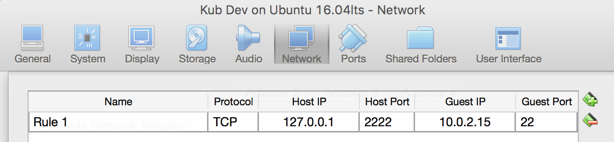
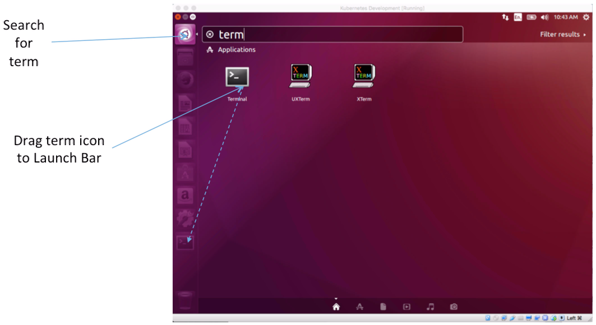
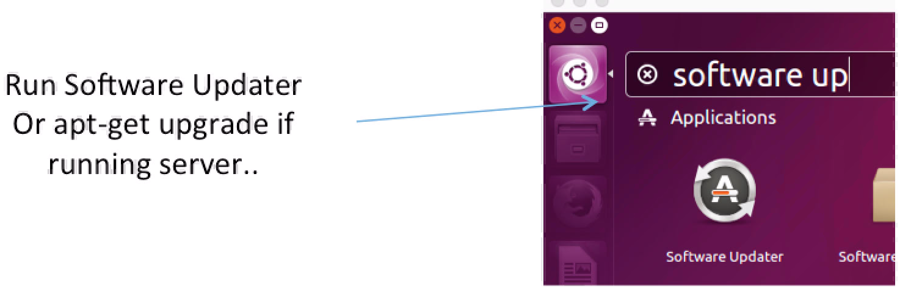
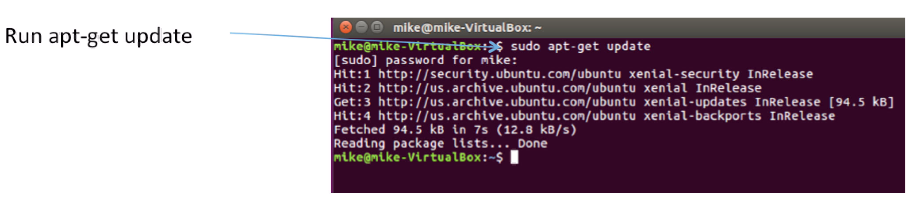
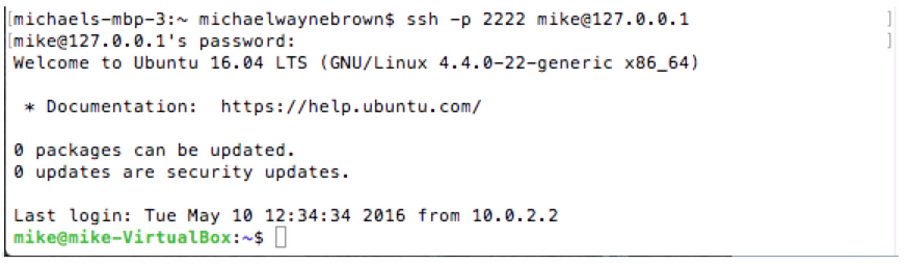
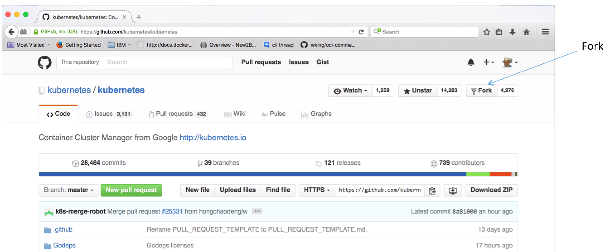
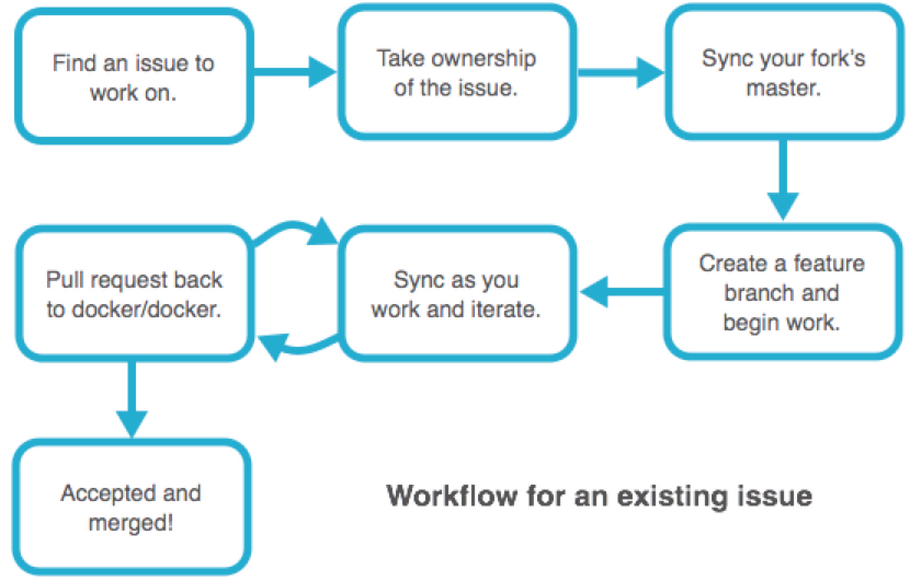
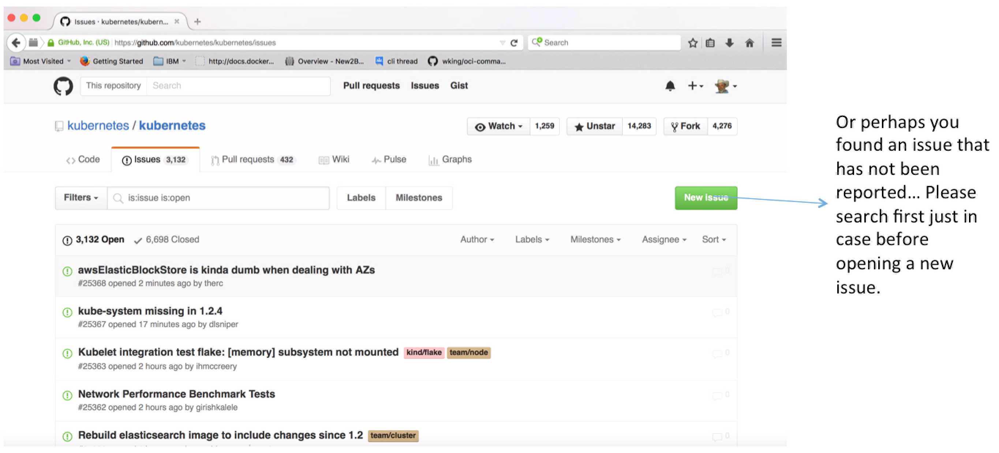

# 面向 Kubernetes 开发者的设置指南
希望修复 Kubernetes？

**标签:** Docker,Kubernetes,Linux,容器

[原文链接](https://developer.ibm.com/zh/articles/setup-guide-for-kubernetes-developers/)

[Michael Brown](https://developer.ibm.com/zh/profiles/brownwm)

发布: 2020-06-17

* * *

本设置指南主要面向正在或将要参与 [Kubernetes](https://kubernetes.io/) 开源项目以及为之做贡献的开发者、技术作家和测试人员。例如，它适用于以下各类人员：想要为 Kubernetes 进行文档编辑、代码修复和草拟新功能；开发和使用各种使用 Kubernetes API 的应用程序，如概要分析、监视和集成工具；开发专门利用 Kubernetes 功能集的服务。

文章一开头先介绍了基础知识。接下来将帮助您设置开发环境。随后，您将了解如何在 Kubernetes 项目中使用 GitHub 和 Git。最后几部分则在开发、构建和测试方面提出了一些建议，您因而可以为 Kubernetes 项目贡献有用的代码。

## 一些基础问题

如果您是 Kubernetes 新手，在我们开始之前，您可能会遇到一些问题。

### 什么是 Kubernetes？

Kubernetes 是一组用 go 编写的应用程序。这些应用程序一起形成了管理容器的交互式平台。

### Kubernetes 源代码位于何处？


Kubernetes 在 [GitHub](https://github.com/kubernetes/kubernetes) 上提供。

### Kubernetes 是 OSS 吗？


Kubernetes 是 Google 捐赠给 [云原生计算基金会 (CNCF)](https://www.cncf.io/) 的开源软件。

### Kubernetes 在何处运行？


Kubernetes 可在许多操作系统/分发版上运行。但是，本指南将向您展示在 [Ubuntu](https://ubuntu.com/) 上开发和测试 Kubernetes 的设置步骤。

## 前提条件

要遵循此设置指南，您需要满足以下前提条件：

- 具有一个 GitHub 帐户
- 掌握 Git、bash 和 Linux 方面的基础知识

## 预估时间

在按照本设置指南中这些步骤的顺序执行操作时，各个步骤的预估时间完全由您来决定。一些开发者会使用跳过链接，他们或许只是将本文用作参考。而另一些人则可能需要半天、一整天甚至几天乃至一周的时间，例如，您遇到了很多问题，或者对 OSS 开发、测试或 Linux 很陌生。

为解决此类时间差异，我提供了一些可跳过的地方。当某些操作即使是专家也需要花费很长时间时，我会告诉您。我还会提供一些捷径，让您能够从小处着手构建和测试，从而加快速度。具体操作需要多长时间取决于您的硬件。例如，某些测试操作在速度较快的集群上可能只需要 10 分钟，而在速度较慢的笔记本电脑上则有可能需要长达 20 个小时。

## 您的开发环境

首先创建基本的 Kubernetes 开发环境：

- Linux 终端和/或 ssh。（参阅 [设置您的主机操作系统](#设置您的主机操作系统)、 [设置 Ubuntu](#设置-ubuntu) 和 [使用并配置 ssh](#使用并配置-ssh)。）
- Go ( [golang.org](https://golang.org/))（参阅 [安装 Go](#安装-go)。）
- Docker（参阅 [安装 Docker 和 containerd](#i安装-docker-和-containerd)。）
- 构建工具（参阅 [安装构建工具](#安装构建工具)。）
- JSON 处理器 jq（参阅 [安装 jq](#安装-jq)。）
- python-pip 和 pyyaml（参阅 [安装 python-pip 和 pyyaml](#安装-python-pip-和-pyyaml)。）
- etcd

如果您已按照自己喜欢的方式完成了所有设置，可随时跳至 [GitHub 和 Kubernetes 项目](#github-和-kubernetes-项目)。

### 设置您的主机操作系统

您需要做的第一件事就是安装 Ubuntu。Ubuntu 16.04 或 18.04 LTS 服务器或桌面版就足够用了。您也可以使用较新的非 LTS 发行版，这取决于您。我现在通过最新的 Virtual Box 在 iMac 上的虚拟机 (VM) 中运行 16.04 LTS 桌面版，通过 Virtual Box 在 Mac 笔记本电脑上运行 18.04 LTS 桌面版，在使用最常用零部件组装的裸机服务器上则运行 18.04 LTS 服务器版。

您当然可以使用虚拟机进行 Kubernetes 开发，我就是这样做的，所以，如果您没有资源来构建自己的服务器，请不要灰心。

要在 Virtual Box 上设置 Ubuntu，应完成以下步骤：

- 下载并安装 Virtual Box： [https://www.virtualbox.org/wiki/Downloads](https://www.virtualbox.org/wiki/Downloads)
- 下载一个 Ubuntu ISO 文件（服务器/桌面版）： [http://www.ubuntu.com/](http://www.ubuntu.com/)
- 使用刚下载的 Ubuntu ISO 创建一个新的 vbox。

考虑以下有关 Virtual Box 设置的建议：

- 基本内存 8g
- 140g vdi 硬盘驱动器
- 共享剪贴板 — 仅双向（如果安装桌面版）
- 显存 128mb（如果安装桌面版）
- 网络：NAT
- 必须安装访客附加组件（如果是桌面版，单击 **VirtualBox VM > Devices > Insert Guest Additions CD Image**…）
- 端口转发规则（参阅高级 **Network** 部分中的按钮）：

    


### 设置 Ubuntu

如果使用 Ubuntu 桌面版，则创建一个终端：



然后运行软件更新程序：



以下截屏展示了如何从终端运行 `apt-get` 更新：



### 使用并配置 ssh

**如果安装了 Ubuntu 桌面版并且要运行 ssh，可完成以下步骤以开始使用 ssh：**

使用您的 PC 或 Mac 客户端通过 ssh 连接到您的 Ubuntu 服务器或桌面版。如果安装了 Ubuntu 桌面版并希望运行 ssh，则运行以下命令：

```
$ sudo apt-get install openssh-server
$ sudo service ssh start or sudo /etc/init.d/ssh start
$ ssh -v localhost

```

Show moreShow more icon

然后从客户端机器（使用密码）登录到 ssh 服务器：



**对于可选的无密码 ssh，完成以下步骤：**

运行端到端 Kubernetes 测试以往通常需要配置无密码的 ssh（使用密钥而不是密码）。如果您不想设置无密码的 ssh，可直接跳至 [安装 Go](#安装-go)。

首先使用以下命令生成 Ubuntu 公钥和私钥：

```
$ ssh-keygen -t rsa

```

Show moreShow more icon

然后使用默认位置并输入密码，或者只按 ENTER 键：

```
$ ssh-copy-id mike@10.0.2.15

```

Show moreShow more icon

在 Mac 上，从 `~/.ssh` 目录运行以下命令以生成密钥：

```
$ ssh-keygen -b 1024 -t rsa -f id_rsa -P ""

```

Show moreShow more icon

将 Mac 公钥（例如，`cat ~/.ssh/d_rsa.pub`）复制粘贴到您的
ubuntu guest `/home/user/.ssh/authorized_keys` 文件中。

接下来，为无密码 ssh 配置 Ubuntu 访客：

```
$ sudo nano /etc/ssh/sshd\_config

```

Show moreShow more icon

对 UN 注释/配置进行以下编辑：

```
PubkeyAuthentication yes

AuthorizedKeyFile %h/.ssh/authorized\_keys

PasswordAuthentication no

PermitRootLogin without-password

```

Show moreShow more icon

重新启动：

```
$ sudo service ssh restart or sudo /etc/init.d/ssh restart

```

Show moreShow more icon

然后，进行测试：

```
$ ssh mike@ubuntu (ubuntu = hostname) or 127.0.0.1 or 10.0.2.15 ...

```

Show moreShow more icon

确保正常工作，然后退出。

由于您将通过无密码形式以 root 用户身份登录，因此可以采取一种便捷方法，将用户公钥和私钥以及 `authorized_keys` 复制到 `/root/.ssh`，例如：

```
$ sudo cp ~/.ssh/authorized_keys /root/.ssh/authorized_keys (you may have to mkdir /root/.ssh)
$ sudo cp ~/.ssh/id_rsa /root/.ssh/id_rsa
$ sudo cp ~/.ssh/id_rsa.pub /root/.ssh/id_rsa.pub

```

Show moreShow more icon

您现在应能从 Mac 终端上的用户帐户，以 root 用户或普通用户身份不使用密码通过 ssh 连接到访客 Ubuntu：

终端 1：

```
ssh -p 2222 root@127.0.0.1

```

Show moreShow more icon

终端 2：

```
ssh -p 2222 mike@127.0.0.1

```

Show moreShow more icon

您还应该能利用 Ubuntu 主机上的用户帐户或 root 用户帐户，通过 ssh 连接到 Ubuntu 主机上的用户帐户和 root 用户帐户：

```
$ ssh root@10.0.2.15
$ sudo ssh root@10.0.2.15

```

Show moreShow more icon

### 安装 Go

在安装时，确保安装 Kubernetes 支持的最新版本的 Go（或尽可能接近）。

从 `https://golang.org/dl/` 中选择所需的版本，然后使用 curl 将其下载到本地主机：

```lang-bash
$ curl -O https://storage.googleapis.com/golang/go1.13.9.linux-amd64.tar.gz

```

Show moreShow more icon

完成以下安装步骤：

```lang-bash
$ tar -xvf go1.13.9.linux-amd64.tar.gz
$ sudo mv go /usr/local
$ rm go1.13.9.linux-amd64.tar.gz

```

Show moreShow more icon

为适用的用户配置环境变量，例如，当前登录的用户 (~)：

```lang-bash
$ sudo nano ~/.profile

```

Show moreShow more icon

和

```lang-bash
$ sudo nano /root/.profile

```

Show moreShow more icon

现在，通过添加以下行将导出路径语句添加到这些文件：

```lang-bash
$ export PATH=$PATH:/usr/local/go/bin:/home/mike/go/bin

```

Show moreShow more icon

注：`/usr/local/go/bin` 用于运行 go 随附的 go 二进制文件，`/home/username/go/bin` 用于运行您使用 go 构建的任何 go 应用程序。

测试配置：

```lang-bash
$ go version

go version go1.13.9 linux/amd64

```

Show moreShow more icon

要以 sudo 方式运行用户个人资料编辑，可运行以下命令：

```lang-bash
$ sudo su --

# source /home/mike/.profile

```

Show moreShow more icon

尽管风险更大，但您可以 root 用户身份登录并通过 visudo 更改 sudo `secure_path` 来添加 go 的路径：

```lang-bash
# visudo

```

Show moreShow more icon

编辑默认 sudo `secure_path`：

```lang-bash
Defaults
secure\_path=\"/usr/local/sbin:/usr/local/bin:/usr/sbin:/usr/bin:/sbin:/bin:/snap/bin:/usr/local/go/bin:/home/mike/go/bin\"

```

Show moreShow more icon

测试您的 sudo 配置：

```lang-bash
$ sudo go version

go version go1.13.9 linux/amd64

```

Show moreShow more icon

### 安装 Docker 和 containerd

有关更多信息，可参阅 [在 Ubuntu 上安装 Docker Engine](https://docs.docker.com/install/linux/docker-ce/ubuntu/)。

要安装 Docker，应先更新软件包：

```lang-bash
$ sudo apt-get update

```

Show moreShow more icon

然后移除任何先前版本：

```lang-bash
$ sudo apt-get remove docker docker-engine docker.io containerd runc

```

Show moreShow more icon

安装 https 传输支持：

```lang-bash
$ sudo apt-get install \
apt-transport-https \
ca-certificates \
curl \
gnupg-agent \
software-properties-common

```

Show moreShow more icon

添加 Docker 的 GPG 密钥：

```lang-bash
$ curl -fsSL https://download.docker.com/linux/ubuntu/gpg | sudo apt-key add -

```

Show moreShow more icon

将 Docker 的稳定发行版添加为 apt 存储库：

```lang-bash
$ sudo add-apt-repository "deb [arch=amd64] https://download.docker.com/linux/ubuntu $(lsb_release -cs) stable"

```

Show moreShow more icon

安装最新稳定版本的 Docker 和 containerd：

```lang-bash
$ sudo apt-get update

$ sudo apt-get install docker-ce docker-ce-cli containerd.io

```

Show moreShow more icon

要选择特定版本的 Docker，可运行以下命令：

```lang-bash
$ sudo apt-get install docker-ce=<VERSION_STRING> docker-ce-cli=<VERSION_STRING> containerd.io

```

Show moreShow more icon

测试您的 Docker 安装：

```lang-bash
$ sudo docker run hello-world

```

Show moreShow more icon

将您自己添加到以 sudo 方式运行的 Docker 组中，因此您无需输入 sudo 即可运行 Docker：

```lang-bash
$ sudo usermod -aG docker mike

```

Show moreShow more icon

重新引导您的 Ubuntu 主机：

```lang-bash
$ sudo shutdown -r

```

Show moreShow more icon

重新引导完主机后，使用 ssh 重新登录到您的主机，然后再次测试 docker，这次不使用 sudo：

```lang-bash
$ docker run hello-world

```

Show moreShow more icon

### 安装构建工具

运行以下命令：

```lang-bash
$ sudo apt-get install build-essential

```

Show moreShow more icon

### 安装 jq

运行以下命令以安装 jq（JSON 处理器）：

```lang-bash
$ sudo apt-get install jq

```

Show moreShow more icon

### 安装 python-pip 和 pyyaml

运行以下命令以安装 python-pip 和 pyyaml：

```lang-bash
$ sudo apt-get install python-pip

$ sudo pip install pyyaml

```

Show moreShow more icon

## GitHub 和 Kubernetes 项目

首先，让我们看一下如何建立分支，然后克隆您的分支。接着，介绍一些关于个人资料和客户端配置的注意事项。最后，您将了解 Kubernetes 项目的 Git 工作流。

### 建立分支

在 GitHub 上为以下项创建开发分支：



- [https://github.com/kubernetes/kubernetes](https://github.com/kubernetes/kubernetes) 上的 Kubernetes 代码
- [https://github.com/kubernetes/website](https://github.com/kubernetes/website) 上的 Kubernetes 网站和文档
- [https://github.com/kubernetes/test-infra](https://github.com/kubernetes/test-infra) 上的 Kubernetes `test-infra`

### 克隆您的分支

通常，在克隆 github.com 源代码存储库时，您可以使用 `$GOPATH/src/github.com` 路径或 `~/go/src/github.com/projectname` 路径（表示
GitHub 中源代码的路径）。这样可以方便使用 go `get` 类型命令拉取 GitHub 托管的数据包。

但是，出于遗留的原因，Kubernetes 包被命名为 `k8s.io/kubernetes`，而不是您可能想到的 `github.com/kubernetes/kubernetes`。因此，要让所有开发工具正常工作并能在磁盘上找到您的数据包代码，就需要将克隆版本放在 `k8s.io` 目录中。

使用以下步骤从您的 name/kubernetes 分支创建 `k8s.io/kubernetes` 源代码树：

```lang-bash
mike@mike-VirtualBox:~/go/src$ mkdir k8s.io
mike@mike-VirtualBox:~/go/src$ cd k8s.io
$ git clone https://github.com/mikebrow/kubernetes.git
$ git clone https://github.com/mikebrow/website.git
$ git clone https://github.com/mikebrow/test-infra.git

```

Show moreShow more icon

结果：源文件从您的分支复制（克隆）到 `go/src/k8s.io/kubernetes` 和 `k8s.io/website` 目录。Git
在您的本地硬盘上为您的 git hub 分支创建一个主分支。

检查分支的状态：

```
$ cd kubernetes

$ git status

On branch master
Your branch is up-to-date with 'origin/master`.
nothing to commit, working directory clean

```

Show moreShow more icon

### GitHub 个人资料建议

考虑以下 GitHub 个人资料建议：

- 向您的公开个人资料添加一个电子邮箱
- 启用双因素身份验证

### Git 客户端配置建议

考虑以下客户端配置建议：

将 `user.*` 条目设置为全局和/或本地：

```
$ git config --local user.name "full name here"

$ git config --local user.email "email address here"

```

Show moreShow more icon

或

```
$ git config --global user.name "full name here"

$ git config --global user.email "email address here"

```

Show moreShow more icon

让推送变得更容易：

```lang-bash
$ git config --global push.default simple

```

Show moreShow more icon

运行以下命令，这样就不需要每次都记住 GitHub 凭证：

```lang-bash
$ git config credential.helper store

```

Show moreShow more icon

告知 git 跟踪针对 kubernetes/kubernetes 在您的硬盘上对克隆分支的更改：

```lang-bash
$ git remote add upstream https://github.com/kubernetes/kubernetes.git

```

Show moreShow more icon

运行 `git config -l` 的结果应类似于：

```lang-bash
user.name=Mike Brown
user.email=brownwm@us.ibm.com
push.default=simple
core.repositoryformatversion=0
core.filemode=true
core.bare=false
core.logallrefupdates=true
remote.origin.url=https://github.com/mikebrow/kubernetes.git
remote.origin.fetch=+refs/heads/*:refs/remotes/origin/*
branch.master.remote=origin
branch.master.merge=refs/heads/master
remote.upstream.url=https://github.com/kubernetes/kubernetes.git
remote.upstream.fetch=+refs/heads/*:refs/remotes/upstream/*
credential.helper=store

```

Show moreShow more icon

### Kubernetes 开源项目的 Git 工作流

下图显示了一个查找和修复 GitHub 上开源产品问题的典型 Git 工作流。尽管此工作流是为 Docker 设计的，但它也适用于 Kubernetes。



在下面的 Kubernetes 问题中找到要处理的内容： [https://github.com/kubernetes/kubernetes/issues](https://github.com/kubernetes/kubernetes/issues)



在您找到的问题上添加一条注释。

如果您有任何疑问，尽管大胆提出。

如果希望解决问题，请说出您的问题。例如，添加一个句子，说明您正在调用 `#dibs`，以表明您正在解决此问题。

如果您不确定自己能否解决该问题，至少应该使用 `#investigating` 表明您正在执行调查分析。虽然没有为您分配，但这会让其他人知道您以后可能会调用 dibs。

## Kubernetes 开发（安装 etcd）

在构建 Kubernetes 之前，您需要安装 etcd。Kubernetes 随附以下脚本来安装 etcd：

```lang-bash
$ hack/install-etcd.sh

```

Show moreShow more icon

将显示的 etcd 路径添加到您的用户个人资料。例如，使用以下命令将 `/home/mike/go/src/k8s.io/kubernetes/third_party/etcd`
添加到您的路径：

```lang-bash
$ sudo nano ~/.profile

$ sudo nano /root/.profile

```

Show moreShow more icon

如果需要，可将其添加到 sudo 的 `secure\_path`：

```lang-bash
$ sudo su -
# visudo

```

Show moreShow more icon

现在，安全路径应类似如下：

```lang-bash
Defaults
secure_path="/usr/local/sbin:/usr/local/bin:/usr/sbin:/usr/bin:/sbin:/bin:/snap/bin:/usr/local/go/bin:/home/mike/go/bin:/home/mike/go/src/k8s.io/kubernetes/third_party/etcd"

```

Show moreShow more icon

重新引导您的主机：

```lang-bash
$ sudo shutdown -r

```

Show moreShow more icon

重新引导完主机后，使用 ssh 重新登录到您的主机，然后测试 etcd：

```lang-bash
$ etcd --version
$ sudo etcd --version

```

Show moreShow more icon

## 使用 make 构建 Kubernetes

使用 help 目标显示 make 选项：

```lang-bash
$ make help

```

Show moreShow more icon

一些免责声明和警告：首次构建、验证和测试时，Kubernetes 需要很长时间，因为它正在构建和下载大量的大型容器镜像。某些下载可能会失败，这会在您首次甚至是第二次尝试运行它们时，导致意外的构建和测试失败。另外，由于测试的某些或许多部分可能会发生“主要”错误，而您将在这些错误基础上构建，并且某些错误仅在长时间超时后才会发生，因此需要耐心。即使所有内容都已下载且没有任何错误，构建、验证和测试步骤预计也要花费大量时间。

如果要构建一切以在本地运行 Kubernetes，可使用 all 目标：

```lang-bash
$ sudo make all

```

Show moreShow more icon

如果只想构建软件包/可执行文件之一，可使用 `make WHAT=cmd/package\_name`。例如，要构建 kublet 服务器，可运行以下命令：

```lang-bash
$ sudo make WHAT=cmd/kublet

```

Show moreShow more icon

根据您所做的更改，可能不会始终构建客户端/服务器软件包。如果要强制同步二者（清除/移除构建二进制文件），可使用 clean：

```lang-bash
$ sudo make clean

```

Show moreShow more icon

要生成发行版，可运行以下命令：

```lang-bash
$ sudo make release

```

Show moreShow more icon

要在不运行测试的情况下生成发行版，可运行以下命令：

```lang-bash
$ sudo make release-skip-tests

```

Show moreShow more icon

## 测试 Kubernetes（单元和集成测试）

在将更改提交到本地开发分支之前，建议您先运行验证、单元和集成测试。根据更改的类型，您可能还需要运行端到端测试存储桶。

在将 PR 推送到 `kubernetes/kubernetes` 之前，构建要完成的验证测试（例如，预提交验证）：

```lang-bash
$ sudo make verify

```

Show moreShow more icon

针对单元测试运行以下命令：

```lang-bash
$ sudo make test

```

Show moreShow more icon

仅针对 `pkg/api/pod` 测试运行以下命令：

```lang-bash
$ sudo make test WHAT=./pkg/api/pod

```

Show moreShow more icon

仅在详细模式下运行 kubelet 测试：

```lang-bash
$ sudo make test WHAT=./pkg/kubelet GOFLAGS=-v

```

Show moreShow more icon

在详细模式下运行 pod 和 kubelet 测试：

```lang-bash
$ sudo make test WHAT="./pkg/api/pod ./pkg/kubelet" GOFLAGS=-v

```

Show moreShow more icon

针对集成测试运行以下命令：

```lang-bash
$ sudo make test-integration

```

Show moreShow more icon

针对 kubelet 集成测试运行以下命令：

```lang-bash
$ sudo make test-integration WHAT=./test/integration/kubelet

```

Show moreShow more icon

在详细模式下运行 pod 集成测试：

```lang-bash
$ sudo make test-integration WHAT=./test/integration/pods GOFLAGS="-v"

```

Show moreShow more icon

### Kubernetes 端到端测试

以下部分展示如何运行 Kubernetes 端到端或 e2e 测试。

#### 1\. 安装 kubetest

运行以下命令来安装 kubetest：

```lang-bash
$ cd ../test-infra
$ sudo GO111MODULE=on go install ./kubetest
$ cd ../kubernetes

```

Show moreShow more icon

#### 2\. 启动本地集群

运行 Kubernetes e2e 测试需要使用集群。e2e 测试可在任何兼容 Kubernetes 的集群上运行。本指南展示了如何创建一个在 Linux 环境中运行的单节点集群。如果遵循上述说明，那么该集群将在裸机上的 VM 或 Ubuntu 主机中以 Ubuntu 访客帐户运行。您使用了两个终端。

有关端到端测试的注意事项：对于默认的 e2e 测试选项，当客户端和服务器的版本不同步时，将不会运行 e2e 测试。现在可以通过设置 `check_version_skew=false`，对不一致的版本运行 e2e。

在终端 1 中，构建 Kubernetes 并启动您的本地集群：

```lang-bash
$ sudo make clean
$ sudo make
$ sudo PATH=$PATH hack/local-up-cluster.sh

```

Show moreShow more icon

在终端 2 中，将 kubectl 配置为与本地集群交互：

```lang-bash
$ export KUBECONFIG=/var/run/kubernetes/admin.kubeconfig

```

Show moreShow more icon

检查您的单节点本地集群的状态：

```lang-bash
$ cluster/kubectl.sh get nodes

NAME        STATUS    AGE
127.0.0.1   Ready     3h

```

Show moreShow more icon

#### 3\. 运行 e2e 测试

在终端 2 中，运行 e2e 密钥测试存储桶：

```lang-bash
$ sudo kubetest --provider=local --test --test_args="--minStartupPods=1 --ginkgo.focus=Secrets"

```

Show moreShow more icon

注：`minStartupPods` 设置为 `1`，以反映本地集群中只有一个节点。

现在运行所有 e2e 测试（这需要很长时间才能完成）：

```lang-bash
$ sudo kubetest --provider=local --test --test_args="--minStartupPods=1"

```

Show moreShow more icon

完成 Kubernetes 集群的使用后，可在终端 1 中使用 `ctrl-C` 快速将其关闭。

有关端到端测试的更多信息，可参阅 [e2e-tests](https://github.com/kubernetes/community/blob/master/contributors/devel/sig-testing/e2e-tests.md)。

### Kubernetes 端到端节点测试

以下部分展示如何运行 Kubernetes 端到端节点测试，也称为 e2e-node 测试。

#### 1\. 安装 ginkgo

运行以下命令：

```lang-bash
$ sudo go get -u github.com/onsi/ginkgo/ginkgo
$ sudo go get -u github.com/onsi/gomega/...

```

Show moreShow more icon

#### 2\. 启动集群

在终端 1 中，启动您的本地单节点集群：

```lang-bash
$ sudo PATH=$PATH hack/local-up-cluster.sh

```

Show moreShow more icon

在终端 2 中，将 kubectl 配置为与本地集群交互：

```lang-bash
$ export KUBECONFIG=/var/run/kubernetes/admin.kubeconfig

```

Show moreShow more icon

#### 3\. 运行 e2e-node 测试

在本地运行 `Sysctls e2e-node` 测试：

```lang-bash
$ sudo make test-e2e-node PARALLELISM=1 FOCUS=Sysctls

```

Show moreShow more icon

运行所有 `e2e-node tests`（这需要很长时间才能完成）：

```lang-bash
$ sudo make test-e2e-node PARALLELISM=1

```

Show moreShow more icon

有关端到端节点测试的更多信息在
[e2e-node-tests](https://github.com/kubernetes/community/blob/master/contributors/devel/sig-node/e2e-node-tests.md)
文档中提供。

### 构建生成的文件

在 `kubernetes/kubernetes` 树中编辑用于生成其他源文件的源文件之后，必须在执行 git commit 之前更新生成的文件。运行以下命令：

```lang-bash
$ sudo make update

Running update-generated-protobuf
Running update-codegen
Running update-generated-runtime
Running update-generated-device-plugin
...

```

Show moreShow more icon

## Kubernetes 文档网站

如果您想为 Kubernetes 文档贡献一份力量，可遵循 [这些说明](https://kubernetes.io/docs/contribute/start/) 进行操作。

## 其他事宜

您不应该就此止步，还应该执行其他一些任务：

- 在提交更改之前，在每个更改的文件上运行 `gofmt -s -w file.go`。
- 在提交更改之前，在每个更改的文件上运行 `golint`。（Kubernetes 团队目前没有使用 lint。但它不会造成任何影响。）
- 在创建或修改功能时，记得更新文档。
- 记住添加测试案例来包含您的更改。
- 在提交修复方法或关闭问题时，应在以下提交消息中引用它们：`Closes #XXXX` 或 `Fixes #XXXX`。
- 在每次提交后，运行测试套件并保证通过测试。
- 在编码的过程中频繁地同步和执行 rebase，以跟上主节点的进度。

## 结束语

我希望本指南可帮助您开始 Kubernetes 开发之旅。查看并遵循 Kubernetes 社区准则，成为成功的贡献者、成员、审查者、批准者（又名“提交者”、“维护者”）和/或子项目负责人。

您可以通过 [brownwm@us.ibm.com](mailto:brownwm@us.ibm.com) 和 `https://twitter.com/mikebrow` 与我联系。

本文翻译自： [Setup guide for Kubernetes developers](https://developer.ibm.com/articles/setup-guide-for-kubernetes-developers/)（2020-05-15）