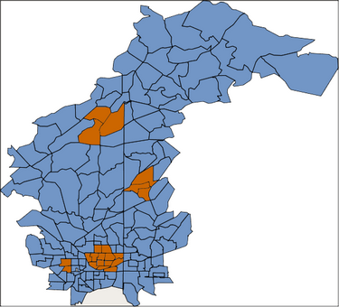

# 面向大数据的时空数据挖掘 第 1 部分
大数据应用

**标签:** 分析

[原文链接](https://developer.ibm.com/zh/articles/ba-cn-spatial-temporal-datamining1/)

杨晓玲

发布: 2016-10-26

* * *

## 面向大数据的时空数据挖掘

早期的数据挖掘研究主要针对字符、数值型的商业数据，随着信息技术的不断提高以及移动设备和网络的广泛使用，数据产生的速度越来越快，数据收集的频率越来越高，数据密度的增长越来越显著，这些因素都使得大数据问题成为一种必然的趋势。而在大数据时代下很多商业数据都包含有时间和空间信息，比如设备，建筑，机构等的管理，能量的产生，分布及预测等。

IBM SPSS Modeler 是参照行业标准 CRISP-DM 模型设计而成的数据挖掘工具，可支持从数据到更优商业成果的整个数据挖掘过程。通过结合时空数据和其他商业数据，并且运用数据挖掘工具 IBM SPSS Modeler 对时间和空间属性进行观测分析，进而获得对数据的充分理解，并将其应用于商业活动，从而改进决策过程。

### 面向大数据的时空数据挖掘的重要性

20 世纪 90 年代中后期，数据挖掘领域的一些较成熟的技术，如关联规则挖掘、分类、预测与聚类等被逐渐用于时间序列数据挖掘和空间结构数据挖掘，以发现与时间或空间相关的有价值的模式， 并且得到了快速发展。信息网络和手持移动设备等的普遍应用，以及遥感卫星和地理信息系统等的显著进步，使人们前所未有地获取了大量的地理科学数据。这些地理科学数据通常与时间序列相互关联，并且隐含许多不易发现的、又潜在有用的模式。从这些非线性、海量、高维和高噪声的时空数据中提取出有价值的信息并用于商业应用，使得时空数据挖掘具有额外的特殊性和复杂性。因此，寻找有效的时空数据分析技术对于时空数据中有价值的时空模式的自动抽取与分析具有重要意义。

近年来，时空数据已成为数据挖掘领域的研究热点，在国内外赢得了广泛关注。同时，时空数据挖掘也在许多领域得到应用，如交通管理、犯罪分析、疾病监控、环境监测、公共卫生与医疗健康等。时空数据挖掘作为一个新兴的研究领域，正致力于开发和应用新兴的计算技术来分析海量、高维的时空数据，发掘时空数据中有价值的信息。

### 面向大数据的时空数据挖掘的挑战

尽管时空数据挖掘研究在近几年引起了人们的广泛关注并得到快速发展，但与传统数据挖掘相比，时空数据挖掘研究还远未成熟。随着时空数据采集效率的不断提高，时空数据积累越来越大，时空数据挖掘也面临诸多挑战。

#### 理论框架

相较于传统的数据挖掘技术，时空数据挖掘研究还远未成熟。对于结构复杂且形式多样的时空数据，如何寻找合适的数据挖掘算法或者技术，可以挖掘什么有价值的模式，如何对这些模式进行分析？这些问题的解决都迫切需要构建一个时空数据挖掘的理论框架。清晰定义的理论框架将会给该研究领域带来理论上的指导，一方面可更好地理解时空模式需要具备的表达能力，另一方面有助于提出更有效的实现技术。

#### 大数据管理

近年来，传感器网络、移动互联网、射频识别、全球定位系统等设备的快速发展和广泛应用，造成数据量的爆炸式增长，数据增加的速度远远超过现有的处理能力。虽然以 MapReduce 和 Hadoop 为代表的大规模并行计算平台的出现，为学术界提供了一条研究大数据问题的新思路，但这些技术也有其固有的局限性。一方面，时空数据本质上是非结构化数据，不仅包含时间序列模型，还存在地图模型，例如城市网络、道路网络等。基于地图模型的算法时间复杂度通常比较大，对时空数据的存储管理和索引技术要求比较高。另一方面，MapReduce 计算模型的组织形式和数据处理方法不适合处理时空数据模型；Hadoop 技术也无法有效支持数据挖掘中监督学习所用的迭代式计算方法，因而无法完全满足时空数据分析的需要。这些对学术界和工业界来数都是一项巨大的挑战。因此，为了分析处理时空大数据，迫切需要更可靠、更有效和更实用的数据管理和处理技术。

#### 时空数据融合

社交网络、遥感和传感器等设备的普遍应用产生了海量的时空数据，且每种设备生成的数据和数据形式各不相同，形成了时空数据结构复杂且来源多样的特性。此外，互联网的蓬勃发展，在文字、音频和视频等多媒体数据中同样包含了丰富的时空数据。例如，广泛覆盖城市的监控摄像头，记录了道路车辆的轨迹信息，从视频中可以还原出被监控车辆的移动轨迹。所以，对时空数据进行有效整合、清洗、转换和提取是时空数据预处理面临的重要问题。

#### 时空推理和数据挖掘的深度结合

时空数据中的时间关系和空间关系通常比较复杂，尤其很多可度量的和不可度量的时间关系和空间关系都是隐含在时空数据中，这就需要在数据挖掘系统中结合时空推理加以考虑这些复杂的时空关系。时空推理和数据挖掘的深度结合，一方面可以发掘更多时空模式及信息，增强时空模式的可理解性；另一方面可以显著提高挖掘的效率和质量。但有利亦有弊：挖掘数据中隐含的时空关系必然会引入某种程度的不确定性和模糊性，这将很大程度上影响数据挖掘的结果。因此，结合时空推理和数据挖掘需要适当折中模型表达能力和时空推理能力。

### 面向大数据的时空数据挖掘的应用

如上所述，时空数据挖掘的应用非常广泛，如交通运输、地质灾害监测与预防、气象研究、竞技体育、犯罪分析、公共卫生与医疗及社交网络应用等。这里我们简单介绍两个时空数据挖掘的应用案例，借此了解一下时空数据挖掘在现实生活中的实际应用。

#### 案例一 – 时空数据分析预测

第一个案例是关于亚特兰大某地区如何根据 1997 年到 2005 年的人口普查数据从而选择 2006 年需要新建银行分行的地点。我们收集的数据包括：1）该地区的地理信息（地图文件）；2）该地区从 1997 年到 2005 年已有银行分行的位置分布情况，包括每个分行的具体地址等；3）该地区从 1997 年到 2005 年的人口统计信息，包括区域 ID，人口密度，家庭收入，男女比例，人种比例等。通过时空数据预测分析，我们可以根据往年银行分行的发展趋势预测出该城市银行分行在下一年即 2006 年的分布密度，同时可以根据该城市家庭收入预测出 2006 年的客户需求，从而得出基于时空数据的银行分行的供求关系，继而确定需要在下一年新建银行分行的准确地点，即选择供不应求的地点进行银行新建。

#### 案例二\- 时空数据关联规则

第二个案例是基于一件发生在美国华盛顿州斯波坎市的一个真实的犯罪历史的犯罪模型分析。这则犯罪事故共发生犯罪事件 816 起，犯罪类型包括吸毒（167 起），抢劫（97 起）和车辆盗窃（552 起），发生时间从 2009 年 1 月到 2010 年 3 月，涉及斯波坎市的 10 个区和 23 条主要街道。我们得到的数据包括斯波坎市的部分地图信息，三种犯罪类型的统计信息以及该地区的人口统计信息，包括人口密度，家庭收入，男女比例，人种比例等。通过时空数据关联规则分析，我们可以根据每种犯罪事件发生的时间和地点得出该种犯罪类型和特定时间段和地理位置的关联关系，比如周末在公路附近多发吸毒事件等。同时我们还可以从时空数据分析中得到非时空数据的关联关系，比如人口密度小的地区多发抢劫事件等。

## 时空数据理解

与传统的数据挖掘一样，不管是时空数据分类预测，时空数据关联规则挖掘还是时空聚类，获取足够的时空数据并充分理解这些数据的特征及属性是时空数据挖掘的先决条件。时空数据，顾名思义，必然包括与时间序列相关的数据以及与空间地理位置相关的数据，另外时空数据挖掘还必须包含将要分析预测或者寻找关联规则的事件数据，也就是在特定时间和空间下发生的具体事件。

### 时间数据的理解

时间数据是指和时间序列相关的数据，表述了目标事件随时间的不同而发生的变化。现实中的数据常常与时间有关，按时间顺序取得的一系列观测值就被称为时间序列数据，这类数据反映了某一事物、现象等随时间的变化状态或程度。如我国 [国内生产总值](http://baike.baidu.com/subview/10147/7957908.htm) 从 1949 到 2009 的变化就是时间序列数据。对时间序列数据进行更深一步的分析和处理，对人类社会、科技和经济的发展有重大意义。目前时间序列的数据挖掘是数据挖掘的重要研究热点之一。时间序列数据可作年度数据、季度数据、月度数据等细分，甚至以周、天、时、分、秒为周期，其中很有代表性的季度 [时间序列模型](http://baike.baidu.com/view/1117294.htm) 就是因为其数据具有四季一样变化规律，虽然变化 [周期](http://baike.baidu.com/view/120466.htm) 不尽相同，但是整体的变化趋势都是按照周期变化的。

上述案例一中，该地区从 1997 年到 2005 年已有银行分行的位置分布情况和人口统计信息就是时间序列数据，找出该地区银行分行从 1997 年到 2005 年之间随时间的发展趋势，从而预测下一年的分布情况是时空数据分析预测的重点之一。在案例二中，从 2009 年 1 月到 2010 年 3 月发生的犯罪事件也包含了时间数据，我们需要进一步分析犯罪事件发生的时间周期（以月为周期，还是以周甚至以天为周期），从而更准确地挖掘出该犯罪事件的发生和时间的关联关系。

### 空间数据的理解

空间数据是指用来表示空间实体的地理位置和分布特征等方面信息的数据，表述了空间实体或目标事件随地理位置的不同而发生的变化。空间数据是数据的一种特殊类型，它是指带有空间坐标的数据，这类数据通常是地图文件，用点、线、面以及实体等基本空间数据结构来表示。一个地图文件通常只包含一种类型的空间数据结构，比如面 （代表国家或者地区），线（代表道路或者河流）或点（代表特定的地址）。如果想要比较复杂的地图文件，其中包含多种空间数据结构的话，通常需要多个地图文件迭加来获得。除了地图信息，空间数据还包括地图信息的背景数据，用来描述地图文件上的对象属性。比如，一个地图文件包含街道，那么就需要相应的背景数据来描述了该街道的大小，名字或者一些分类信息（分行道，单行道，双行道，禁止通行等）。

上述案例一中，亚特兰大某地区的地理信息即地图文件就是空间数据，描述了该地区的拓扑结构，以多边形来表示该地区的不同区域。同样，在案例二中，斯波坎市的部分地图信息就是空间数据，描述了斯波坎市的空间地理分布情况，用多边形表示斯波坎市的 10 个不同地区，用线表示斯波坎市的 23 条主要街道。

### 事件数据的理解

事件数据是指事务性的数据，表述了在某个时间区间某个地理范围之内所发生的事件。事件数据通常和时间数据相关，甚至时间数据本身同时也是事件数据，都是在某个时间序列上发生的一系列事件。不同的是，时间数据的关注点是目标事件发生的时间，或者说是时间序列数据中的时间变量，而事件数据的关注点是在某个时间序列上发生的事件。事件数据一般不会和地图文件直接相关，而是包含坐标值来关联事件数据和地图文件。事件数据的每一条记录通常都指的是某个特定的人或事，并且包括和该人或事相关的其他信息，比如该人或事的具体地理位置。

上述案例一中，该地区从 1997 年到 2005 年已有银行分行的位置分布情况就是事件数据，描述银行分行的地理位置，并包含坐标值和该地区的地图文件相关联。在案例二中，从 2009 年 1 月到 2010 年 3 月发生的犯罪事件同时也是事件数据，描述不同的犯罪类型，吸毒、抢劫和车辆盗窃，分别发生在斯波坎市的不同区域。

## 时空数据预处理

时空数据结构复杂且来源多样，在充分理解了时间数据，空间数据和事件数据的特征、属性及他们之间的关联关系的基础上，整合、清洗和转换不同来源的时空数据，使得他们符合特定时空数据挖掘算法的要求，是时空数据预处理面临的重要问题。本节我们将结合 IBM SPSS Modeler 详细介绍时空数据预处理的方法和步骤。

### 时间数据预处理

时间序列数据结构复杂且来源多样，如何将不同来源的时间序列数据合并并用于时空数据分析，是时空数据预处理面临的首要问题。不同时间序列数据的时间起点及时间间隔都不尽相同，想要合并多个时间序列数据就必须要求每个时间序列数据具有相同的时间间隔，这就需要对各个时间变量的时间间隔进行构建。在 IBM SPSS Modeler 中，时间间隔的构建有两种方法，汇总和填充。

汇总是一个经常用于减小数据集大小的数据准备手段。执行汇总之前，应该花一些时间来清理数据，尤其要关注缺失值。一旦完成汇总，或许会丢失可能有用的缺失值信息。我们可以选择基于指定的汇总函数来汇总时间间隔较小的数据，不同类型的数据可以用不同的汇总函数。连续性时间变量可以通过均值、合计、众数、最小值和最大值来汇总，而离散型变量则可以通过众数、第一个和最后一个汇总组中的非空值来汇总。

填充是用于替换字段值的一种方法，也可以用来将空白值或空值指定为特定值。我们也可以选择基于指定的填充函数来替换字段值，同样，不同类型的数据可以用不同的填充函数。连续性时间变量可以使用”最近点的平均值”，即将要创建的时间周期之前的三个最近非空值的均值来替换或者填充新的字段值，而离散型时间变量则可以用将要创建的时间周期之前的最近非空值来替换或者填充新的字段值。

在将多来源的时间序列数据合并的过程中，我们需要根据指定的时间间隔来选择汇总或者填充时间字段。例如，如果有以周和月为单位的混合数据，则可以对周值进行汇总或”累计”，以获得均匀的月间隔。或者，也可以将间隔设置为周，并通过为所有缺失周插入空白值或使用指定的填充函数外推缺失值来填充序列。

### 空间数据预处理

我们已经知道，空间数据是数据的一种特殊类型，它是指带有空间坐标的数据，用点、线、面以及实体等基本空间数据结构来表示。但是空间坐标有不同的表达方式，有些空间数据的坐标是多个单维坐标形式， 如用三个单独的字段 x, y, z 分别表示三维坐标; 有些空间数据的坐标是一个多维坐标形式，如用一个列表[x, y, z]来表示三维坐标。既然涉及坐标，就必然会关系到坐标系，而不同空间数据的坐标系往往不同。另外，和时间数据一样，空间数据来源多样，每个空间数据的基本数据结构都不尽相同，如何关联多种类型的数据结构同样是空间数据预处理面临的重要问题。

首先来看多个单维坐标字段和一个多维坐标字段之间的转换，这个过程通常比较简单。在 IBM SPSS Modeler 中，这个过程只需要组合多个单维坐标字段即可实现，例如，直接用[]组合单独的坐标字段 x, y, z，返回的派生字段即为列表[x, y, z]。

任何一个空间数据，不管是地图，坐标还是经纬度值，都会关联一个坐标系。坐标系定义了坐标值的原点，单位，正方向等，是坐标值的参照系。坐标系的种类很多，大体可以归纳为两大类，地理坐标系和投影坐标系。地理坐标系，是球面坐标系统，以经纬度为地图的存储单位的。投影坐标系，是平面坐标系统，其地图单位通常为米。要得到投影坐标就必须得有一个”拿来”投影的球面坐标，然后才能使用算法去投影，即每一个投影坐标系统都必须要求有地理坐标系参数。坐标转换是 [空间实体](http://baike.baidu.com/view/3700293.htm) 的位置描述，是从一 [种](http://baike.baidu.com/view/324270.htm) [坐标系统](http://baike.baidu.com/view/261065.htm) 变换到另一种坐标系统的过程，通过建立两个 [坐标系统](http://baike.baidu.com/view/261065.htm) 之间一一对应关系来实现。在 IBM SPSS Modeler 中，我们可以选择一个或者多个坐标转换的地理字段，指定要转换的坐标系，从而实现多个地理字段统一坐标系的目的。

如上所述，一个空间数据或地图文件通常只包含一种类型的空间数据结构，如果想要比较复杂的地图文件，其中包含多种空间数据结构的话，通常需要多个地图文件迭加来获得。比如，我们有面图表述某地区的不同区域和线图表述该地区的河流街道，那么如何得到不同的河流街道和各个地区之间的位置关系呢？在 IBM SPSS Modeler 中，我们可以通过位置函数来获得不同类型的空间数据结构之间的位置关系。例如，用 close\_to()来确定某条河流是否靠近某个地区，用 distance()来获得两个地区或者两条街道之间的距离等。

### 事件数据预处理

事件数据是时空数据挖掘的主题，它的每一条记录都是特定的人或事，并且包括该人或事的相关信息，特别是发生的地理位置。事件数据的预处理通常是指和时间数据或者空间数据的整合，以便获得最终可以直接应用于时空数据挖掘算法的数据。具体内容详见下节时空数据的融合。

## 时空数据的融合及展示

上文我们已经了解了时空数据来源多样且结构复杂，不管是时间数据、空间数据还是事件数据都有其自身的特征和属性，如何融合各种数据并把结果展示出来对时空数据挖掘至关重要。

### 时空数据的融合

时空数据的融合通常是通过合并时间数据、空间数据和事件数据来完成的。数据合并的方法很多，可以按记录顺序合并，可以通过多个数据共有的关键字来合并，还可以根据自定义的条件进行合并。按关键字或者自定义条件合并又可分为内连接，全外连接，部分外连接等。

事件数据和时间数据的融合可以通过关键字，譬如区域 ID 号，邮政编码，事件发生时间等来实现。例如，在上述案例一中，我们可以设置区域 ID 号或者时间字段为关键字来融合从 1997 年到 2005 年的银行分行分布数据和人口统计数据。

由于涉及空间地理位置，事件数据和空间数据的融合通常按照事件数据进行左外连接。在 IBM SPSS Modeler 中，这种左外连接还结合位置函数来获得事件发生的地点和空间数据结构之间的位置关系。例如，在上述案例二中，我们要融合犯罪事件文件和斯波坎市的地图文件，可以选择犯罪事件为主数据对犯罪事件和地图文件进行左外连接，用位置函数 close\_to()来查找某种犯罪事件发生的地点和斯波坎市街道在某个特定范围内的临近关系，或者用位置函数 within()来定位某种犯罪事件是否发生在某个特定区域。

### 时空数据的展示

由于空间数据是一种特殊的数据类型，使得时空数据说起来比较抽象，本小节我们就将时空数据以图形方式给出一个简单的展示。

我们已经知道，时空数据首先是基于一张地图，包括不同的空间数据结构，比如多边形（面），线，点等， 通常以.shp 格式存在。简单的理解，单独的空间数据即使一张某地区的地图。例如，在上述案例一中的亚特兰大某地区的地图用 IBM SPSS Modeler 中的图形文件如图 1 所示，其中多边形表示不同区域。

##### 图 1：亚特兰大某地区地图

如果有多个地图文件，并且经过预处理之后，各个地图文件有相同的坐标系，则可迭加输入从而得到多层次的地图文件，比如多边形上贯穿线串表示道路，河流等。如果已经融合了事件数据，我们还可以设置不同的符号和颜色分别表示不同的事件，比如在上述案例二中，用三角形表示吸毒，用圆圈表示抢劫，用方形表示车辆盗窃，如图 2 所示。

##### 图 2：斯波坎市犯罪事件地图

## 结束语

大数据时代下，随着数据收集效率的不断提高和时空数据挖掘的快速发展，很多不同来源的商业数据都包含有时间和空间信息，比如设备，建筑，机构等的管理，能量的产生，分布及预测等。如何结合时空数据和其他商业数据，并且通过对时间和空间属性的观测分析获得决定性的认知从而优化决策就显得至关重要。本文通过介绍面向大数据的时空数据挖掘的重要性及面临的挑战，详细描述了运用数据挖掘工具 IBM SPSS Modeler 对时空数据的理解、预处理，融合及展示，为下一步进行时空数据的建模预测以及关联规则的挖掘奠定了基础。

## 参考资源

- 参考期刊《计算机研究与发展》论文 [2013-时空数据挖掘研究进展](http://wenku.baidu.com/link?url=WPUuNND_LAHnUoJDlKRMuMU-rUemq6rfw_VR_JzMpfS624V_hVxMPTeJbGedvOA8w66iSE4_gJlmJoJE3OK8hAXEr34DSAg1x_5P3mMXDbm) ，了解时空数据挖掘的研究进展。
- 参考南京师大学报（自然科学版）文献 [面向大数据](http://wenku.baidu.com/link?url=vv1aaM6tRaoA4_qZgnNtFRgzBz3URhAG524tlcbBrn0VrS-AWcbF-7WQTdT-lG-jApGCuX_2EATE3uazVfYVbMjBMBEmP7xhKeEZeVpN0zC) [的](http://wenku.baidu.com/link?url=vv1aaM6tRaoA4_qZgnNtFRgzBz3URhAG524tlcbBrn0VrS-AWcbF-7WQTdT-lG-jApGCuX_2EATE3uazVfYVbMjBMBEmP7xhKeEZeVpN0zC) [时空数](http://wenku.baidu.com/link?url=vv1aaM6tRaoA4_qZgnNtFRgzBz3URhAG524tlcbBrn0VrS-AWcbF-7WQTdT-lG-jApGCuX_2EATE3uazVfYVbMjBMBEmP7xhKeEZeVpN0zC) [据](http://wenku.baidu.com/link?url=vv1aaM6tRaoA4_qZgnNtFRgzBz3URhAG524tlcbBrn0VrS-AWcbF-7WQTdT-lG-jApGCuX_2EATE3uazVfYVbMjBMBEmP7xhKeEZeVpN0zC) [挖掘综述](http://wenku.baidu.com/link?url=vv1aaM6tRaoA4_qZgnNtFRgzBz3URhAG524tlcbBrn0VrS-AWcbF-7WQTdT-lG-jApGCuX_2EATE3uazVfYVbMjBMBEmP7xhKeEZeVpN0zC) ，了解面向大数据的时空数据挖掘的应用与挑战。