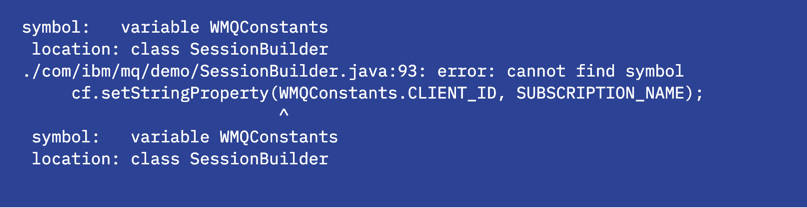
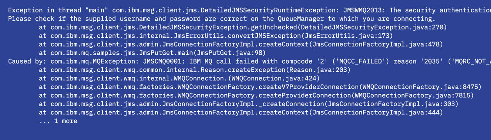
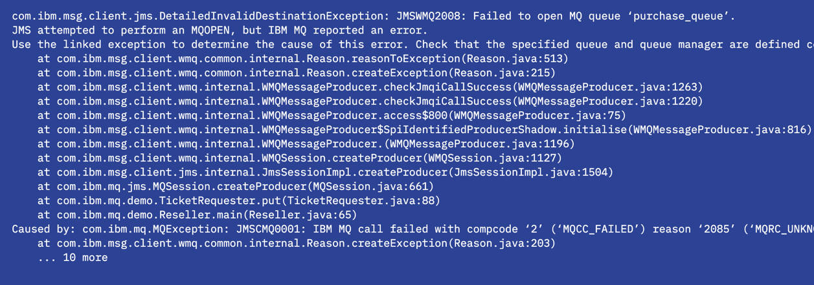
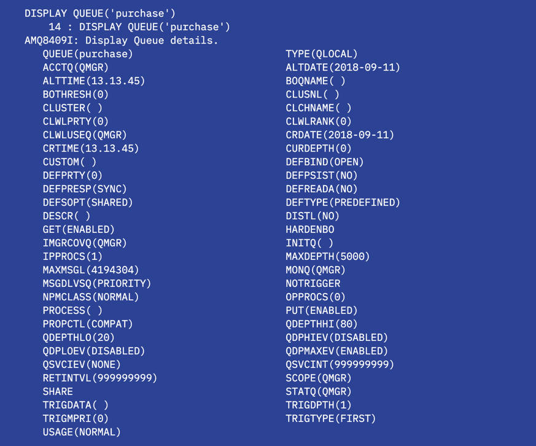

# 面向开发者的 IBM MQ 备忘单
轻松调试 IBM MQ 常见错误的提示和技巧

**标签:** IBM MQ

[原文链接](https://developer.ibm.com/zh/articles/mq-dev-cheat-sheet/)

Richard J. Coppen

发布: 2020-07-27

* * *

##### 学习路径：IBM MQ Developer Essentials 徽章

本文是 IBM MQ Developer Essentials 学习路径和徽章的一部分。

- [IBM MQ 基础知识](/zh/articles/mq-fundamentals/)
-  使用 [MQ on Containers](/zh/tutorials/mq-connect-app-queue-manager-containers/)、 [MQ on Cloud](/zh/tutorials/mq-connect-app-queue-manager-cloud/)、 [MQ on Ubuntu](/zh/tutorials/mq-connect-app-queue-manager-ubuntu/) 或 [MQ on Windows](/zh/tutorials/mq-connect-app-queue-manager-windows/) 来启动并运行队列管理器。
- [准备使用 Java 编程](/zh/tutorials/mq-develop-mq-jms)
- [接受消息传递编程挑战](/zh/tutorials/mq-badge-mq-dev-challenge)
-  调试应用程序或环境（本文）

场景如下：您已完成了应用程序编程，而且已编译并首次运行了该应用程序。激动人心的时刻！糟糕，生成了一条错误消息。

不要惊慌！即使是最优秀的开发者，也会遇到这种情况。

下面可以开始调试了，但应该从哪里着手呢？

导致应用程序失败的原因可能有很多，我们该如何判断这是消息传递代码、MQ API 调用还是 MQ 相关对象的问题呢？

如果错误消息包含 MQ 原因码（例如 AMQ2035 2035 MQRC\_NOT\_AUTHORIZED），则可能是与 MQ 进行交互时出现错误。

通常，可以从错误消息中明显看出问题出在哪里，然后您可以纠正代码并继续下一步。但是，有时还需要进行更多调试。以下部分将介绍一些基本调试步骤，并提供一些相关的提示和技巧以便您继续下一步。

## 常见问题或错误

我们将介绍大多数 MQ 应用程序开发者新手将遇到的一些常见问题，包括编译错误、连接问题、配置错误、安全问题等。您会对此有全面的了解。

### 稍等片刻，我的应用程序还没有编译好！

我一直在尝试编译自己的代码，但是不断收到下面这样的错误：



如果您的代码由于某种原因而未进行编译，那么常见原因有以下几种：

- 您是否为了使用 `javac` 而安装了 JDK？可在命令行中输入 `java -version` 来检查这一点。
- 是否提供了 `jms.jar` 和 `com.ibm.mq.allclient.jar`？
- 检查您的 `classpath`。是否正确输入了 jar 文件的位置？
- 确保在命令中使用了适用于您操作系统的文件目录分隔符。

### 求助！我收到了一个 MQ 原因码，该怎么办？

我尝试运行自己的代码，但一直收到下面这样的异常：



您可以通过浏览异常详细信息来获得大量信息。在上面的示例中，您可以看到应用程序尝试使用的连接信息、队列管理器名称、连接模式以及主机名和端口。其中还提供了可能出现的问题的相关信息。在第七行中，您可以看到应用程序失败时发出的返回码（在此例中为 2035）。此处记录了 MQ 原因码列表。

要了解有关所发生的问题的更多详细信息，最好是查看 IBM MQ 队列管理器的错误日志。事实上，我们是通过队列管理器来找出错误。错误日志位于运行队列管理器的系统上的 MQ 数据目录中。

在 Docker 容器中：

```
docker exec -ti <container_id> /bin/bash

```

Show moreShow more icon

```
cd /var/mqm/qmgrs/<your_queue_manager_name>/errors/

```

Show moreShow more icon

在 Linux 上：

```
cd /var/mqm/qmgrs/<your_queue_manager_name>/errors/

```

Show moreShow more icon

在 Windows 系统上：

```
cd <mq_installation_path>\QMGRS\<your_queue_manager_name>\ERRORS\

```

Show moreShow more icon

接下来，我们来查看错误日志文件。最新日志条目将添加到该文件的底部。您可以使用编辑器来查看日志，例如，在 Docker 或 Linux 中：

```
cat AMQERR01.LOG

```

Show moreShow more icon

在这里，您可以看到在生成 2035 返回码时的条目：


### 连接问题

初始连接是最经常出现问题的地方之一。这会提供诸如2538 MQRC\_HOST\_NOT\_AVAILABLE 或 2059 MQRC\_Q\_MGR\_NOT\_AVAILABLE 之类的 MQ 原因码。有几个地方可能会引入错误，首先要执行以下检查：

- 检查是否可以 ping 通用于运行队列管理器的主机。

- 检查是否使用正确的端口连接到队列管理器。

     除非您将环境变量 MQ\_BADGE\_QM\_PORT 设置为其他值，否则 MQ Badge Challenge 应用程序将使用 1414。如果您由于某种原因（例如，正在运行多个 Docker 实例或队列管理器）而无法使用端口 1414 并且端口 1414 已被使用，则可能需要执行此操作。要使用其他端口号，您需要先公开该端口。然后，您可以设置端口环境变量。

     在 Windows 终端中：


    ```
    set MQ_BADGE_QM_PORT=<your_port>

    ```


    Show moreShow more icon

     在 Linux 上：


    ```
    export MQ_BADGE_QM_PORT=<your_port>

    ```


    Show moreShow more icon

- 检查是否使用正确的主机连接到队列管理器。

     除非您将环境变量 MQ\_BADGE\_QM\_HOSTNAME 设置为其他值，否则 MQ Badge Challenge 应用程序将使用 “localhost”。如果您在较旧版本的 Docker 中运行队列管理器，则可能需要执行此操作。最新版本的 Docker 会将主机 ip 地址映射到 localhost，但是 Docker Toolkit（这是 Windows 7 上当前用于运行 Docker 的选项）会将主机 ip 映射到虚拟机 ip 地址。要找到此 IP 地址，可以在 Docker 中运行以下命令：


    ```
    docker-machine ip

    ```


    Show moreShow more icon

     然后，可以在 Windows 终端中运行以下命令，以在应用程序中使用此主机地址：


    ```
    set MQ_BADGE_QM_HOSTNAME=<your_ip_address>

    ```


    Show moreShow more icon

- 检查您的应用程序连接详细信息中使用的队列管理器和通道名称是否正确。它们区分大小写。在 MQ Badge Challenge 应用程序中，如果您不想使用默认值，则会对环境变量 `MQ_BADGE_QM_NAME` 和 `MQ_BADGE_QM_CHANNEL` 进行外部化处理。

- 检查队列管理器是否正在运行：

     在托管队列管理器的系统上，直接在终端窗口中运行 dspmq 命令：


    ```
    dspmq

    ```


    Show moreShow more icon

     对于 Docker 实例，您将使用以下命令来获取命令行访问权并运行 dspmq：


    ```
    docker exec -ti <container_id> dspmq

    ```


    Show moreShow more icon

     dspmq 的输出是系统上队列管理器及其状态的列表：

    


### 配置错误

我的应用程序已连接但无法运行，该怎么办？

主要仔细检查一下所有 MQ 对象名是否都与期望值匹配。例如，如果提供了错误的队列名称，那么将产生以下错误：



在此例中，日志告诉我们队列 `purchase_queue` 不存在。后续步骤是使用 `runmqsc` 检查您的配置或相应地更改您的代码。有关 [MQSC 命令](#interact-with-the-queue-manager-using-mqsc-commands) 的更多信息，请参阅下文。

### 安全问题

身份验证是另一个经常导致问题的地方。安全问题通常会返回原因码 AMQ2035 2035 MQRC\_NOT\_AUTHORIZED。如果您看到此原因码，则表示您已尝试建立连接，但是所使用的用户名或密码可能有问题。通过查看错误日志，您可以了解用于身份验证的用户 ID。

在 MQ Badge Challenge 应用程序中，已将用户名和密码编码到应用程序中，以便将其提供给队列管理器。检查是否已设置正确的值。如果您使用的不是默认应用程序用户名和密码，则可能在我们提供的代码中更改了这些值，也可能通过设置环境变量 MQ\_BADGE\_USERNAME 和 MQ\_BADGE\_PASSWORD 覆盖了默认值。

有关更多信息，阅读 [有关客户端应用程序安全性的 IBM MQ 产品文档](https://www.ibm.com/support/knowledgecenter/en/SSFKSJ_9.1.0/com.ibm.mq.sec.doc/q010290_.htm)。

### 发布/订阅错误

通常由于以下某个原因导致发布/订阅问题：

- 订阅者主题字符串与发布者不匹配。
- 订阅是在发送发布后创建的。
- 发布中发生错误，但发布应用程序未检查出该错误。

这些都会导致您未收到期望的消息。

### 使用 MQSC 命令与队列管理器进行交互

利用 MQSC 命令，您可以执行一些管理任务以配置队列管理器和使用队列管理器对象，例如，通道和队列。

知道如何确定各个 MQ 对象（例如 qmgrs、队列或通道）上设置的属性可能会对您很有帮助，尤其是在您不熟悉默认设置的情况下。其中一种方法是使用 MQSC。有关更多信息，请参阅 Knoweldge Center 中的“ [使用 MQSC 命令进行管理](https://www.ibm.com/support/knowledgecenter/en/SSFKSJ_9.1.0/com.ibm.mq.adm.doc/q020620_.htm)”。

对于 Docker 实例，您需要在运行队列管理器的容器中具有命令行访问权：

```
docker exec -ti <container_id> /bin/bash

```

Show moreShow more icon

从这里（或任何平台的命令行）：

```
runmqsc <your_queue_manager_name>

```

Show moreShow more icon

当您看到以下消息时，就可以在界面中输入内容：


您可以使用 DISPLAY 命令来浏览 MQ Badge Challenge 中的某些对象。例如，DISPLAY CHANNEL(DEV.APP.SVRCONN)、DISPLAY TOPIC(‘newTickets’) 和 DISPLAY QUEUE(‘purchase’)。

`DISPLAY QUEUE('purchase')` 命令的输出如下所示：



这里要注意的一个有趣属性是 maxdepth，这是队列可以保留的消息数；还有一个属性是 curdepth，这是队列中当前保留的消息数。如果队列上的消息数达到了 maxdepth，则应用程序将失败，并显示 MQ 原因码 2053 MQRC\_Q\_FULL。可使用以下几种方法来解决此问题：增加默认 maxdepth (5000)，或通过暂停应用程序或将消息放入另一个队列等方式来确保发送应用程序可以处理原因码 2053 (MQRC\_Q\_FULL)。

### 使用 MQ 控制台与队列管理器进行交互

与队列管理器进行交互的另一种方法是使用 MQ 控制台。使用控制台，除了可以浏览和更改对象属性外，还可以通过将测试消息放入队列中来帮助验证设置。（验证设置的另一种方法是运行样本，例如 amqsputc，前提是您有权访问这些样本。）

我无法在浏览器中进行连接？

- 您可能会发现，如果您在 Docker 中运行队列管理器，则无法访问 `https://localhost:9443/ibmmq/console/`。使用 Docker 命令 `docker-machine ip` 来检查要用于代替 `localhost` 的 IP 地址。

- 检查是否为 MQ 控制台分配了在启动容器时要使用的端口 9443。如果由于任何原因而更改了此端口号，确保使用正确的端口号。


## 结束语

本文介绍了 IBM MQ 应用程序中最常见的错误类型。 恭喜！调试成功，一切都正常运行。您可以继续开发。

要获取更多的故障排除信息：

- 访问 IBM Knowledge Center 以获取 [有关问题确定的更详细文档](https://www.ibm.com/support/knowledgecenter/en/SSFKSJ_9.1.0/com.ibm.mq.tro.doc/q038550_.htm)。

- 您还可以访问 [通过 MQ 生成应用程序的最佳实践](/zh/articles/mq-best-practices)。


本文翻译自： [IBM MQ cheat sheet for developers](https://developer.ibm.com/articles/mq-dev-cheat-sheet/)（2020-06-23）