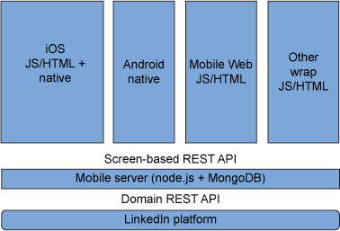

# 面向移动应用程序的 DevOps 挑战和最佳实践
10 个面向移动企业的 DevOps 最佳实践

**标签:** 移动开发

[原文链接](https://developer.ibm.com/zh/articles/mo-bestdevops-mobileapps/)

Leigh Williamson, Sanjeev Sharma

发布: 2014-07-31

* * *

在过去五年中，许多行业在努力适应业务应用程序用户行为的巨大转变，因为全球数百万人已采用移动设备作为其访问互联网的主要方式。用户行为的这种重大转变是企业为现有业务应用程序开发移动渠道的强大动力，也是为使用移动设备独特特征的新应用程序类型制定计划的强大动力。与 IT 行业的所有主要演变一样，此转变的最初几年见证了满足需求和建立市场地位的大量活动，但没有考虑到更多的战略问题，比如应用程序开发成本、可维护性、质量和安全性。随着移动应用程序市场走向成熟，最初的市场高峰已趋于缓和，现在的焦点是更全面的软件开发问题。

在本文中，我们介绍了在企业中集成移动应用程序所面临的挑战，并提供了移动 DevOps 的 10 个最佳实践。我们首先将概述 DevOps，并解释在 DevOps 商店中集成移动企业应用程序所面临的一些具体挑战（及其必要性）。接下来，我们提供了在工作流中实现 DevOps 的 10 个最佳实践，以便将持续集成、应用程序测试和监控，以及移动应用程序交付结合起来。

## 什么是 DevOps？

_DevOps_ 不是一种技术或流程，而是一种支持从开始到生产过程的无缝应用程序交付的方法。在 DevOps 出现之前，企业组织通常保持独立的开发和运营团队。团队之间缺乏沟通和协作，这在很多方面阻碍了企业的发展和创新。对于采用敏捷开发的企业来说，最令他们苦恼的是开发和运营的分离，因为使用敏捷方法使要开发、测试和部署的新应用程序版本数量增加了数倍。开发人员能够每隔几个小时就生成出构建版本，并以更高的频率提供发布候选版本，而不是每几个月才能向运营团队提供一个新构建版本。

DevOps 移动从开发和运营团队协同工作以更有效地解决持续应用程序交付所面临的挑战开始。最初的目标是 “转移” 运营责任，包括软件交付生命周期早些时候的运营。接下来，鼓励开发人员从开始编码应用程序时就考虑运营因素。实际上，DevOps 会协调开发人员和运营经理的兴趣和知识背景，方法是使用精简开发的原则让持续集成和持续交付流程变得更高效。

IBM 从整体的角度来看 DevOps，将它定义为 _企业的持续软件交付能力，可让客户抓住市场机遇并缩短客户的反馈时间_ 。

此定义中的关键词是 _持续交付_ 。持续交付表示在软件交付生命周期的任意阶段自动根据需要部署软件及其运行的环境。在持续交付中，您可能部署任何内容 — 从简单的配置更改，到增量式代码更改、数据库模式更改，再到环境更改或整个堆栈的更改。

## 面向移动应用程序的 DevOps

无论是对企业 Web 应用程序进行编码，还是对移动应用程序进行编码，DevOps 都采用相同的基本原则。在为企业采用 DevOps 之前，请包含您的移动开发团队，即使此移动团队只是企业的一小部分或者是它采用了不同的软件开发流程。如果您正在开发作为现有企业应用程序和服务前端的移动应用程序，那么更应如此。无论应用程序是面向客户的还是仅供内部使用，都是如此。

与企业应用程序和服务直接交互的移动应用程序需要是 DevOps 生命周期的基本因素。向企业应用程序或服务添加新功能时，团队可以将它们无缝地集成到移动应用程序。

## 移动 DevOps 挑战

尽管企业和移动应用程序的 DevOps 基本原则是相同的，但是移动应用程序会提出具体的 DevOps 挑战。这些挑战包括：

1. **多平台支持**

    移动应用程序没有一个环境目标。大多数移动应用程序都可以在多个设备上使用，这意味着要处理各种技术规范、操作系统版本和外观因素。Android 以各自为政而出名，每个设备供应商都为其自己的设备创建了操作系统（示例包括 Android for Nexus、Android for Kindle Fire 和 Android for Nook）。现在，BlackBerry 10、Windows® Phone 8、Ubuntu 和 Firefox 等新进入者进一步分裂了 Android 市场。同样，曾经非常标准的 iOS 目前也具有多个变体。iOS 应用程序需要支持不同版本的 iOS；iPhone 4S 和更低的设备；iPhone 5，以及 iPad 和 iPad mini。

2. **使用移动应用程序作为企业前端**

    移动应用程序，尤其是企业 B2C 或 B2E 移动应用程序，通常在移动设备上没有什么业务逻辑。相反，企业已使用 B2C 或 B2E 移动应用程序作为一个或多个企业应用程序的前端，比如事务处理系统、员工人力资源系统或客户获取系统。下图突出显示了本身具有有限业务逻辑的应用程序。

    

    _来源： [LinkedIn Engineering 博客](http://engineering.linkedin.com/testing/continuous-integration-mobile)_

    LinkedIn 移动应用程序是后端 LinkedIn Platform（包含 LinkedIn 的 Profile、Connections 和 Groups 应用程序或服务）的前端。移动应用程序（作为一个原生或混合应用程序提供给多个平台）需要后端 LinkedIn Platform 服务一起开发和交付。对于 DevOps，挑战是全面思考企业中的所有应用程序并协调器构建和版本流程与周期。

3. **持续集成和持续交付**

    由于想要将移动应用程序快速推向市场，因此移动开发项目通常具有非常紧迫的时限。从启动到交付通常需要几个月或几周的时间。快速交付移动应用程序的压力迫使人们采用敏捷开发方法来实现最成功的移动项目。

    持续集成和持续交付是所有敏捷项目的重要元素。对于所有目标移动操作系统来说，必须立即处理开发人员提交的应用程序更改。如果移动应用程序是混合或本机实现，那么每次开发人员交付应用程序更改集时都会触发几个不同的应用程序版本。所支持的移动环境的构建设置和配置各不相同。您很可能需要配置一个小型构建服务器场，并使用它们来处理多个操作系统构建版本。

4. **应用商店**

    在大多数情况下，无法将移动应用程序直接部署到设备上。必须使用应用商店。Apple 引入了此应用程序分发模式，并锁定其设备以避免应用程序开发人员或供应商直接安装应用程序。RIM 等设备制造商也纷纷效仿这一做法。

    应用商店为部署流程添加了一个额外的异步步骤，因为开发人员不能按需部署应用程序更新。即使对于关键的 bug 修复，新的应用程序版本也必须经过应用商店提交和审核流程。持续交付变为 “提交并等待”。

5. **‘拉’ 而不是 ‘推’ 部署**

    大多数传统部署以 “推” 模式运行，而运营可以按需推出一个新应用程序版本，无论它是 Web 应用程序还是其他任何基于服务器的应用程序。更新移动应用程序的流程是 “拉” 流程，但是在大多数情况下，用户必须自己选择更新应用程序。移动应用程序开发人员难以控制用户在其设备上使用的应用程序版本。从开发运营的角度来看，这意味着已部署的后端服务（与应用程序交互）必须为之前的移动应用程序版本提供持续支持。

6. **对于消费者应用程序，失败不是一个选择**

    对于品牌来说，没有比应用程序的评级为 1 星更糟糕的事情了，尤其是评级通过应用商店媒介传播时。如果用户对消费者移动应用程序不满意，那么公众很快就会知道这一消息，无论应用程序是付费的还是免费提供的。尽管网站投诉问题会提交给技术支持服务台，但是移动应用程序投诉会通过应用商店进行传播，所有人都能看到这些投诉。移动应用程序必须经过大量功能性、可用性和性能测试来保证其质量。

## 移动 DevOps 的 10 个最佳实践

根据移动应用程序所面临的具体挑战，我们推荐了 10 个面向移动应用程序的 DevOps 最佳实践。这些实践按照功能可分为三大类，即：

1. 持续集成和持续交付
2. 测试和监控
3. 移动应用程序交付

我们的目标是使用 10 个最佳实践来创建一个支持这三种功能的交付管道，同时解决移动应用程序所面临的具体挑战。

##### DevOps 的理论和实践

DevOps 交付管道实现 DevOps 的技术方面，但它对满足 DevOps 移动的人文和文化方面也很重要。本部分的最佳实践旨在确保企业将移动开发和 QA 团队作为其 DevOps 社区的重要组成部分。整体 DevOps 哲学必须考虑移动应用程序开发团队（与开发企业 Web 应用程序和服务的团队合作）的需求和关注事项。

### 持续集成和持续交付

1. **确保所有资产的端到端可追溯性**

    所有开发和 QA 资产的可追溯性值不再是一个争议不断的主题。移动应用程序开发团队必须确保所有开发资产的端到端可追溯性 — 比如代码、配置、脚本、基础架构即代码、测试脚本和设计文档。可追溯性并不仅限于移动开发资产也很有必要；它必须能够扩展到移动应用程序与之进行集成、连接或访问的企业应用程序和服务。

2. **持续集成实践**

    敏捷开发实践宣扬 _持续集成_ ，这意味着运行频繁的构建版本，并将新代码与其他团队之前开发的代码集成在起来 — 移动和企业应用程序。持续集成确保一个开发团队交付的代码与其他开发团队交付的代码和模块一起工作。对移动应用程序来说，通常会持续地执行集成。也可以使用组成后端（正在开发的移动应用程序可以访问它）的非移动服务器端组件定期执行集成。

    对于移动应用程序，开发团队将会共享移动应用程序代码（为所有目标移动平台提供服务）的中央构建和集成服务器。自动化构建和开发流程可确保提供快速而又可靠的持续集成构建，这些构建在所有受支持平台的中央构建服务器或服务器场上执行。

3. **为受支持的每个本机移动操作系统 SDK 版本保持独立的构建和集成区域**

    移动设备领域的分裂延伸到了 iOS、Android、Blackberry 和 Windows Phone 这 4 种主要移动操作系统之外；每种操作系统的内部也是分裂的。Apple 创建了其自己的操作系统来支持 iPad。Android 几乎为每种设备创建了一个变体。RIM 的 BlackBerry 10 是一个全新的操作系统，与旧 BlackBerry OS 的关系并不大。Windows Phone 8 是之前的 Windows Phone 的重大重组。还出现了一些新的移动平台，包括来自 Ubuntu 和 Firefox 的移动平台。因此，移动应用程序开发人员必须编写多种应用程序变体来支持每种目标平台及其变体，即使它们只针对一个目标平台也是如此。每个移动应用程序都需要多个 SDK 版本。

    要确保代码和每种目标平台的具体功能相分离，开发人员必须为移动应用程序的每个特定平台版本保持独立的开发 “流”。这就需要针对每个目标平台保持独立的构建和集成区域。如果是 Android 应用程序，那么开发人员需要针对 Kindle Fire、Nook HD、Nexus 和其他操作系统保持独立的流。

4. **使用自动化的构建和部署脚本**

    移动开发人员已习惯使用 IDE 手动运行构建版本。他们通常手动运行构建版本，在某些情况下，将针对不同的目标平台运行构建版本。随着构建版本的数量和复杂性不断增加，开发人员可以设置自动构建版本，方法是使用脚本根据需要在独立的构建服务器上运行构建版本。管理构建脚本和分配版本的方式与代码类似，都要确保任意团队成员随时都可以重现每个构建版本。

### 测试和监控

1. **在模拟和物理设备上尽可能自动对每个构建版本进行全面测试**

    测试自动化是移动应用程序开发落后于企业应用程序的地方。大多数移动开发人员在模拟器而不是物理设备上进行广泛测试。模拟器上的测试大部分是手动的。考虑到开发的速度和移动开发的敏捷本质，自动化的功能回归测试是保证质量的唯一方式。考虑到所支持的各种平台和外形，通过手动方式进行足够的测试不太可能。此外，对于企业应用程序来说，无论它们是用于客户还是员工，质量低劣都是不能接受的。

    使用自动测试工具在 SDK 提供的模拟器上和受支持的所有实际物理设备上测试所有应用程序。

2. **虚拟化和模拟移动应用程序测试期间不可用的后端服务**

    移动应用程序遵循快速开发流程，与后端企业应用程序和服务相比，这会生成更多的版本。此类快速开发可以让移动应用程序在技术方面领先于企业应用程序，这意味着它们拥有后端企业应用程序和服务还不支持的新功能。即使在后端服务可用时，可能也需要花费金钱或资源来对它们进行测试。例如，SaaS 服务通常有按使用付费的成本，即使是测试也是如此。同样，System z (mainframe)-托管服务也有 MIPS 成本。开发团队还可以通过虚拟化（模拟）后端服务来解决这一问题。与移动应用程序进行交互的整个应用程序、服务和数据来源生态系统，可以作为虚拟实例提供，模拟移动应用程序需要进行交互的实际功能行为。这种安排可以快速测试移动应用程序及其交互。还可以节省运行这些服务和应用程序的实际实例所需的硬件资源。

3. **监控已部署的移动应用程序和后端服务的性能**

    移动应用程序开发人员面临的最大挑战是应用程序在测试环境中运行良好，但在实际使用中却出现了故障。不可靠的网络环境、内存低、电力不足和数据丢失是移动应用程序性能差的一些根本原因。在实验室中，并不是所有这些情况都是可以预测和测试的，因此当务之急是开发人员应在使用应用程序时启用持续性能监控。可以在应用程序中或与应用程序交互的应用程序堆栈服务器端进行监控。

    当用户实际使用时移动应用程序停止运行，则会出现最终性能故障。出现故障时，为捕获 “必须收集” 的上下文信息的应用程序添加逻辑，比如位置数据和设备特性，并为开发人员提供足够的数据来查找故障的根本原因并纠正它。嵌入式崩溃捕获和分析逻辑是移动应用程序的重要组件。

### 移动应用程序交付

1. **为移动配置概要文件、认证和 API 密钥采用集中管理**

    无论是将应用程序提交到应用商店，还是使用内部或外部应用程序提供的 API，开发人员或公司都可以通过供应商发布的配置或配置文件密钥来确定应用程序的真实性和所有权。这些密钥可以充当商店或 API 的授权阶段。通常，各个开发人员会单独获得他们用于开发的密钥。但是，当发布最终应用程序时，会删除所有这些个人密钥并使用官方企业密钥替换它们。保护企业密钥和配置文件，并且只将它们用于官方应用程序版本。必须良好地定义和控制移动管理流程。最重要的是，限制对企业密钥的访问。授权是一个需要严格管理的安全和隐私问题。

2. **使用虚拟应用商店测试设备部署**

    只能通过供应商的应用商店将移动应用程序配置到移动设备。通常，在应用程序进入应用商店之前，会经过一个手动审批流程。在将应用程序放入商店后，用户需要 “购买” 应用程序，然后将应用程序部署到设备上。要测试整个过程，开发团队可以使用一个 “专有开发应用商店”。这些虚拟应用商店（请参见 参考资料 ）模拟了真实应用商店的行为，允许开发人员有效地测试提交应用程序的过程，并将应用程序配置到设备上。

3. **将用户反馈转换为改进请求和用户案例**

    移动应用程序有一个通过应用商店进行反馈的独特机制，允许用户评级并提供书面反馈。深受欢迎的应用程序可能会得到 4 星或 5 星评级。不受欢迎的应用程序通常会得到 1 星或 2 星评级，可能还伴随着负面反馈。移动应用程序的反馈循环不可以作为其他任何平台的正式集中机制。通常情况下，只有在用户请求技术支持或在开发人员监控的论坛上留下评论时，开发人员才会发现有关桌面应用程序的问题。移动开发团队应该密切监控应用商店反馈和评级，并将反馈纳入未来的用户案例、增强和软件改进中。充分利用此宝贵反馈是持续改进移动应用程序必须做的事。

## 结束语

面向移动应用程序的 DevOps 是独一无二的。DevOps 是一种适用于所有应用程序和组件的方法 — 从前端移动应用程序，到中间件，再到后端服务器组件和数据存储。企业中的所有开发和运营团队都应用 DevOps 实践和原则来支持所有组件的持续开发。

移动应用程序有一些必须解决的具体需求和挑战。我们的 10 个面向移动应用程序的 DevOps 最佳实践解决了这些特定于移动的需求。这些最佳实践的目的是让移动应用程序开发、质量保证和运营实践与标准的企业应用程序保持一致。利用这些最佳实践，企业可以在其移动开发团队中采用 DevOps，交付高质量的移动应用程序，并支持持续改进和创新。

本文翻译自： [DevOps for mobile apps challenges and best practices](https://developer.ibm.com/articles/mo-bestdevops-mobileapps/)（2014-05-13）