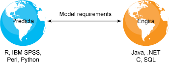
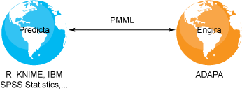

# 预测解决方案的实际应用
探索预测性分析的部署

**标签:** 预测分析

[原文链接](https://developer.ibm.com/zh/articles/ba-predictive-analytics4/)

Alex Guazzelli

发布: 2013-02-26

* * *

## 简介

过去，实际应用预测解决方案是一项非常繁杂的过程，需要投入大量的时间和资源。预测模型标记语言 (PMML) 的出现彻底改变了这一局面。构建解决方案的开发人员现在可以在几分钟之内就将预测解决方案投入使用。作为预测分析的事实标准，PMML 受到所有顶级数据挖掘供应商的支持，包括商业和开源的供应商。构建好预测模型后，可以很轻松地将其导出到一个 PMML 文件中。之后，您可以直接将该文件部署到一个基于 PMML 的评分引擎中，并在该引擎中执行。考虑到我们所处的大数据时代，预测模型应当从快速部署和执行中获益。评分解决方案在云和数据库中的可用性使得预测分析能够实现其承诺并破解大数据代码。

本系列文章共有四部分，介绍了许多预测分析主题，大部分与模型开发有关。我已经介绍了预测分析的许多应用。但是，对于将要应用到新数据的预测解决方案，需要对其进行有效的部署。也就是说，需要将它从科学家的台式机迁移到一个可操作的环境中，也就是从开发过渡到投入使用。

照目前来看，将模型投入到实际使用中并不是一件简单的事。要实现有效的部署，预测解决方案需要成功地连接起两个完全不同的世界。我将之称为 _Predicta_ 和 _Engira_ 星球。Predicta 星球的居民精通统计、数据挖掘和 Perl 及 Python 等语言技能的数据科学家。而 Engira 星球的居民则是精通 Java™ 、.NET、C、SQL 语言的 IT 工程师。如果没有一种通用的语言，预测解决方案在从 Predicta 迁移到 Engira 的中进行转换时将会迷失方向（参见 [图 1](#如果没有通用的语言，模型部署流程在从-predicta-迁移到-engira-星球进行转换时将会迷失方向) ）。开发完模型之后，数据科学家将编写一个 word 文档描述该模型，然后发送给一名 IT 工程师，后者开始将该模型编码为一个可操作环境。这个过程中将不断出现新问题，科学家和 IT 工程师之间将反复传递问题记录。然而，多数情况下，当任务模型可以投入使用时，对其重新编码的工程师发现，模型在生产环境中生成的分数与科学家在开发过程中获得的分数并不匹配。工程师必须与科学家沟通来解决这种差异。这个过程可能需要三个月到一年的时间。

##### 图 1.如果没有通用的语言，模型部署流程在从 Predicta 迁移到 Engira 星球进行转换时将会迷失方向

幸运的是，一种通用语言的出现使得模型部署从几个月缩短到了几分钟。数据科学家和 IT 工程师都可以理解这种语言。这种语言就是 PMML。

## PMML

PMML 由 Data Mining Group (DMG) 提出，这是一个由多个公司组成的联盟，这些公司共同完成了对 PMML 的定义。所有商业的和开源的顶级统计和数据挖掘工具都支持 PMML。因此，在 Predicta 星球上开发的模型现在可以直接发送给 Engira 星球并立刻完成部署。不需要进行转换和重新编码，也不需要编写自定义编码。有了 PMML，将预测解决方案从科学家的台式机上迁移到可操作环境中将变得非常简单。

PMML 允许企业和个人只使用一种语言来表示完整的预测解决方案，与开发解决方案的环境无关。本系列文章的第 3 部分介绍了创建预测解决方案所涉及的所有阶段，从数据预处理和模型构建，一直到模型评分的后处理。PMML 能够在一个单一文件中呈现所有这些阶段。PMML 还可以呈现包含多个模型或一个模型组合的解决方案。

PMML 基于 XML，其模式遵循一个定义良好的结构，在这个结构中，元素和属性都用于定义以下内容：

1. `DataDictionary` 元素定义输入数据
2. `MiningSchema` 元素定义用于处理策略的无效值、遗漏值和异常值
3. `TransformationsDictionary` 元素定义数据预处理
4. 通过 `NeuralNetwork` 、 `TreeModel` 、 `SupportVectorMachineModel` 、 `Scorecard` 和 `RegressionModel` 等特定的模型元素定义各种建模技术
5. 通过 `Output` 元素定义模型输出的后处理

PMML 还包含其他语言结构，包括用于模型验证、模型解释和评估的特定元素。由于 PMML 可以使用一种清晰的结构化方式完整地呈现预测解决方案，因此我们可以使用它来解密预测分析背后的秘密。公司不仅可以使用 PMML 作为 Predicta 和 Engira 之间的通用语言，还可以作为服务提供商和外部供应商之间的通用语言。在这种情况下，PMML 为预测解决方案的交换定义了一个单一、清晰的流程。PMML 不仅成为了数据分析、模型构建和部署系统之间的桥梁，还成为了分析流程所涉及的所有人员和团队之间的桥梁。这一点尤其重要，因为我们使用 PMML 来传播知识和最佳实践，并确保透明性。

PMML 的最新版本 V4.1 在 2011 年 12 月发布。然而，作为一种语言，PMML 已经有超过 10 年的历史，因此，它已经非常成熟和完善。当多年以前 DMG 代表向我介绍 PMML 时，我被它的范围、功能以及为那些希望利用历史数据的预测价值的企业所带来的所有收益深深震撼。

## 使用 PMML 表示预测解决方案

目前市场上所有用于模型开发的顶级统计工具都使用 PMML 导出模型。其中一些还提供导入功能，因此可以可视化模型并进行进一步的优化。一个值得一提的开源环境就是 KNIME（参见 参考资料 ），该模型导入和导出许多 PMML 模型。另一个就是用于统计计算的 R 项目（参见 参考资料 ）。各种商用产品也支持 PMML。在本文中，我将重点介绍 IBM SPSS Statistics，该产品能够针对不同的预测技术导出 PMML。IBM SPSS Statistics 还可以导出 PMML 以实现数据预处理，这是预测分析的一项重要内容。

本系列文章的第 3 部分介绍了如何使用 IBM SPSS Statistics 自动执行数据预处理。目的是增加原始输入数据的预测价值，从而提高生成模型的准确度。为此，选择 **Transform menu > Prepare Data for Modeling** 并单击 **Automatic** 。在以制表符分隔的 “Automatic Data Preparation” 窗口中，单击 **Settings** 选项卡并选择 **Apply and Save** 。选中 “Save transformations as XML” 框并输入一个文件名称。该文件将包含 PMML 格式的转换。选择 **Prepare Data for Modeling** 选项后，您还可以选择 **Interactive** 。该选项将显示一个以制表符分隔的窗口，名为 “Interactive Data Preparation”。这时，您需要首先单击 **Analyze** 按钮，然后再保存包含所生成的转换的 PMML 文件。无论是哪种情况，您都将得到一个 PMML 文件，其中完整描述了 IBM SPSS Statistics 为了进行建模而执行的数据预处理步骤。要想了解 PMML 如何表示数据转换，Zementis 发布了一个名为 _Transformations Generator_ 的交互工具。该工具允许用户以图形方式表示各种转换，并自动使用 PMML 导出这些转换，随后，这些转换可以与一个模型文件合并（参见 参考资料 ）。

数据准备过程还将在 IBM SPSS Statistics 数据编辑器中创建额外的数据字段，这些字段可与其他原始输入字段共同用于模型培训。如本系列第 3 部分所述，如果要培训一个神经网络模型，只需要选中 **Analyze menu > Neural Networks** 并选择 **Multilayer Perceptron** 即可。在多选项卡窗口中做出所有适当的选择后，选择 **Export** 选项卡，选中 “Export synaptic weight estimates to XML file” 并输入您希望将神经网络模型导入到其中的 PMML 文件的名称。类似地，IBM SPSS Statistics 还允许使用 PMML 导入许多其他的预测技术。

神经网络模型的 PMML 文件还包含数值输入的缩放和分类变量的离散化。然而，如果您的模型使用由 IBM SPSS Statistics 自动发现的任何变量，那么您将需要合并前面提到的两个 PMML 文件（将自动数据预处理和模型合并为一个文件）。为此，选择 **Utilities menu > Merge Model XML** 。您将看到一个窗口，可以在其中输入名称 “Model XML File”（包含预测模型的 PMML 文件）和 “Transformation XML File”（包含自动或交互数据预处理步骤的 PMML 文件）。同时为 “Saved Merged XML File” 输入一个名称。单击 **OK** 。现在，您的预测解决方案已经全部用 PMML 呈现完毕。

## 使用 PMML 实现有效部署

使用 PMML 呈现预测解决方案后，可以在几分钟之内就完成部署。在 Zementis 中，我们创建了一个基于 PMML 的预测分析决策管理平台，称为 ADAPA。该平台能够使用以 PMML 表示的预测解决方案并实时执行。由于 ADAPA 位于可操作端，因此它使 Engira 资源摆脱了自定义编码的负担，并允许 Predicta 资源有机会独立部署预测解决方案。如 [图 2](#借助-pmml，使用-predicta-资源构建的预测解决方案可以在几分钟之内完成部署) 所示，当一个预测模型从 IBM SPSS Statistics 导出后，或者从任何与 PMML 兼容的工具（如 R 和 KNIME）导出后，数据科学家可以直接将该模型上传到 ADAPA 以供使用。

##### 图 2.借助 PMML，使用 Predicta 资源构建的预测解决方案可以在几分钟之内完成部署

在 ADAPA 中完成上传后，预测模型可以通过一个 Web 控制台或 Web 服务直接管理和执行。对于后一种情况，可以将评分和预测直接嵌入到企业中的任意应用程序。

对于现场部署，ADAPA 可以作为传统许可使用。ADAPA 还可以在 IBM SmartCloud 上作为服务使用。在云中，模型的执行可以通过 Internet 获得一个经济高效且可扩展的计算结构。Zementis 还提供了 Universal PMML Plug-in (UPPI)，用于数据库内部评分和 Hadoop。UPPI 目前可用于 EMC Greenplum 数据库、SAPSybase IQ 和 IBM Netezza。通过这种方式，使用 PMML 表示的模型可以在数据库内部轻松部署，并紧挨着数据本身。需要在数据库内部评分的应用程序通常涉及大数据。IBM 估计如今 90% 的数据都是在过去两年中产生的。可以想像整个社会每天生成并收集的数据量有多大。大数据意味着海量数据。要想从这些不断增长的数据中发现隐含的有价值信息，实现预测解决方案的快速部署和执行是关键。幸运的是，通过结合 PMML、强大的数据库、Hadoop 和云计算，发掘大数据中隐含的价值已成为现实。

## IBM SmartCloud 中的模型执行

从本质上讲，云计算就是一组通过 Internet 提供计算资源的服务。大型数据中心以服务的形式交付可扩展的、按需提供的且常常为虚拟化的资源，这就避免了对特定硬件、软件或自己的数据中心基础架构的投资。 _云_ 一词用于隐喻 Internet。云计算支持各种服务，包括存储容量、处理能力和业务应用程序。在云中访问服务直到最近才成为一种安全、可靠的基础架构。IBM SmartCloud 是泛型云基础架构的一个典型示例。它由 IBM 开发，通过分布在全球范围内的若干个数据中心在云中提供动态的计算容量。

软件即服务 (SaaS) 是一个软件许可模型，企业或用户可以在其中通过 Internet 访问软件，并通过付费来获得一定期限内某个软件的使用权，而不需要购买永久的软件许可并在内部安装。这对于客户来说极其有利，因为他们不需要在服务器设置或软件许可方面投入前期费用，并且最小化了购买昂贵软件却不能获得相应的投资回报的风险。由于 SaaS 许可模型和云计算都是以 Internet 为中心，因此更多的供应商结合使用二者来交付新型的软件解决方案。

如前所述，ADAPA 使用 Web 服务调用来使自动决策真正嵌入到企业的系统和应用程序中。为了最小化总拥有成本，ADAPA 中的模型执行可以通过 IBM SmartCloud 以服务形式提供（参见 参考资料 ）。Zementis 和 IBM 的合作允许企业部署和执行预测模型，并轻松使用所生成的评分和预测来影响他们的日常运营。

在 IBM SmartCloud 中启动虚拟的 ADAPA 服务器的过程与购买硬件并在服务器机房中安装硬件的传统场景是相似的。惟一的区别是前者的服务器位于云中，附带了预安装的 ADAPA 版本，可以按需启动，启动时间只需要几分钟并可以立即投入使用。

## 结束语

过去，部署预测解决方案并投入使用是一个漫长的过程，需要几个月的时间，负责构建模型和负责将其重新编码到生产环境中的人员需要付出大量宝贵精力。PMML 的出现显著改变了这一局面。借助 PMML，负责构建模型的人员只需要几分钟即可完成模型部署。

作为呈现预测模型的事实标准，PMML 可以用一种清晰的结构化方式完整地呈现预测解决方案。所有顶级的商业和开源统计软件包都支持 PMML。例如，IBM SPSS Statistics 能够使用 PMML 导出数据转换以及几种预测建模技术。然后，PMML 文件可以轻松部署到 ADAPA（基于 PMML 的 Zementis 评分引擎）等系统中。由于 ADAPA 可以在 IBM SmartCloud 中使用，因此它能够从这个由 IBM 提供支持的可扩展、可靠的基础架构中获益。部署到云中后，预测模型可以随时随地进行访问，并且它们的评分和预测通过 Web 服务被嵌入到企业的任意应用程序中。

阅读本系列的四篇文章后，您应当对预测分析及其应用有了基本了解。我首先向您介绍了预测分析的定义，构成预测分析核心内容的多种预测技术。这些技术可以从历史数据中学习模式并在新数据中检测这些模式。然后，我介绍了如何创建一个完整的预测解决方案。首先是对问题明确定义，然后执行数据分析和预处理。之后将数据提交给一种预测技术以进行模型构建，稍后将评估模型的准确度。根据模型的准确度以及与预测错误相关的成本设定鉴别阈值。之后，将业务决策与不同的阈值建立关联。最后，当将预测解决方案导出为一个 PMML 文件时，即可对其进行部署和使用。完成这些步骤后，预测分析才真正履行了其承诺：从历史数据中学习有价值的模式并使用它们预测未来。

本文翻译自： [Put a predictive solution to work](https://developer.ibm.com/articles/ba-predictive-analytics4/)（2013-02-26）