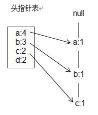
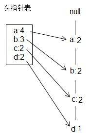
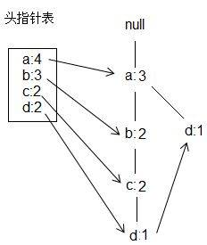
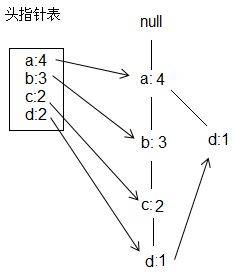
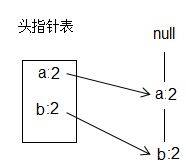
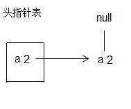
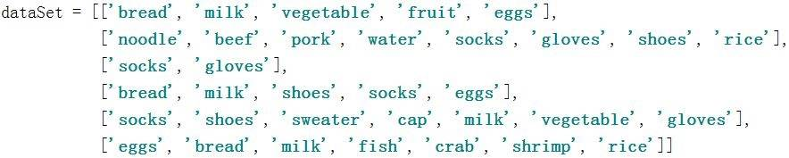

# 频繁项集与关联规则 FP-growth 的原理和实现
深入了解机器学习

**标签:** 分析

[原文链接](https://developer.ibm.com/zh/articles/machine-learning-hands-on2-fp-growth/)

韩笑琳

发布: 2017-11-21

* * *

本文将介绍机器学习领域经典的 FP-growth（Frequent Pattern Growth）模型，它是目前业界经典的频繁项集和关联规则挖掘的算法。相比于 Apriori 模型，FP-growth 模型只需要扫描数据库两次，极大得减少了数据读取次数并显著得提升了算法效率。您将看到 FP-growth 的原理介绍、FP-growth 实现步骤和详解、FP-growth 实现代码以及用 FP-growth 解决实际的频繁项集和关联规则挖掘问题。通过阅读本文，您会对 FP-growth 的原理了如指掌，并可以自己开发出 FP-growth 的实现代码。

## 从啤酒和尿布引出的频繁项集

在机器学习系列文章的 [第一篇](https://www.ibm.com/developerworks/cn/analytics/library/machine-learning-hands-on1-svn/index.html) 中，主要介绍了支持向量机 SVM 模型的原理和实现。在文章一开始，笔者提到机器学习主要分为四大类，分别是分类，聚类，回归和关联分析。第一篇中的 SVM 就属于分类。那么下面笔者开始介绍关联分析。关联分析分为频繁项集挖掘和关联规则挖掘。

生活中的数据本身包含着各种规律，机器学习模型可以从数据中挖掘出这些规律，啤酒与尿布就是一个典型的例子。有研究发现，在超市的订单记录中，啤酒和尿布总是频繁共同出现在同一条订单记录里。换句话说，买尿布的人，往往会顺手买啤酒。这就引出了本文的主题之一，即 **频繁项集** 。频繁项集是在数据库中大量频繁出现的数据集合。那么发现这些频繁项集有什么意义呢？

1. 用于 _制定营销策略_ 。如同啤酒与尿布的例子，超市如果将啤酒和尿布放在相邻的位置，会增加两者的销量。还可用于制定打折促销活动，给买了啤酒和尿布的客户打折，也可以增加销量。
2. 用于 _发现共现词_ 。这种场景其实我们经常会遇到。当我们在浏览器中输入”频繁项集”时，浏览器自动弹出如”频繁项集 置信度”，”频繁项集 关联规则”等备选记录，我们每每都会感叹浏览器的智能，其实这里的秘诀就是频繁项集。也就是说，在大量的用户搜索记录中，”频繁项集”和”置信度”共同出现在了大多数的搜索记录中。同理，”频繁项集”和”关联规则”也频繁得共同出现在搜索记录中。
3. 用于 _发现事物的热点信息_ 。从新闻报道和微博中获取关于某事物的相关文档，然后应用频繁项集挖掘算法可以得到该事物的热点新闻。

主流的频繁项集挖掘算法有 Apriori 和 FP-growth。其中 Apriori 算法需要多次扫描数据库，这就使得该算法本身不适合大数据量。FP-growth，即 Frequent Pattern Growth，它通过构建 FP 树(即 Frequent Pattern Tree)这样的数据结构，巧妙得将数据存储在 FP 树中，只需要在构建 FP 树时扫描数据库两次，后续处理就不需要再访问数据库了。这种特性使得 FP-growth 算法比 Apriori 算法速度快。FP 树是一种前缀树，由频繁项的前缀构成，具体细节会在频繁项集挖掘原理一节介绍。挖掘出频繁项集后，可以从频繁项集中进一步挖掘关联规则。

## 关联规则简介

**关联规则** 是在频繁项集的基础上得到的。关联规则指由集合 A，可以在某置信度下推出集合 B。通俗来说，就是如果 A 发生了，那么 B 也很有可能会发生。举个例子，有关联规则如：{‘鸡蛋’, ‘面包’} -> {‘牛奶’}，该规则的置信度是 0.9，意味着在所有买了鸡蛋和面包的客户中，有 90%的客户还买了牛奶。关联规则可以用来发现很多有趣的规律。这其中需要先阐明两个概念：支持度和置信度。

### 支持度 Support

**支持度** 指某频繁项集在整个数据集中的比例。假设数据集有 10 条记录，包含{‘鸡蛋’, ‘面包’}的有 5 条记录，那么{‘鸡蛋’, ‘面包’}的支持度就是 5/10 = 0.5。

### 置信度 Confidence

**置信度** 是针对某个关联规则定义的。有关联规则如{‘鸡蛋’, ‘面包’} -\> {‘牛奶’}，它的置信度计算公式为{‘鸡蛋’, ‘面包’, ‘牛奶’}的支持度/{‘鸡蛋’, ‘面包’}的支持度。假设{‘鸡蛋’, ‘面包’, ‘牛奶’}的支持度为 0.45，{‘鸡蛋’, ‘面包’}的支持度为 0.5，则{‘鸡蛋’, ‘面包’} -> {‘牛奶’}的置信度为 0.45 / 0.5 = 0.9。

关联规则用于发现 if -> then 这样的规则，并可以给出这条规则的可信度（即置信度）。现实场景中可以用来发现很多规律，下面举个例子。在信息安全领域，需要根据已有流量数据制定规则，来判断是否触发安全报警。如规则{‘数据包大’，’多个 ip 地址同时发送数据’} -> {‘异常’}，该规则的置信度为 0.85。这条规则表示，当流量数据包大，并有多个 ip 地址同时向目标 ip 发送数据时，则有 85%的概率存在异常，需要触发报警。

## 频繁项集挖掘原理

频繁项集挖掘分为构建 FP 树，和从 FP 树中挖掘频繁项集两步。本节用如下表所示的数据集作为例子展开，该示例数据集共四条数据。

##### 表 1\. 示例数据集

**数据集**a,b,cc,d,b,ad,e,ab,a

### 构建 FP 树

构建 FP 树时，首先统计数据集中各个元素出现的频数，将频数小于最小支持度的元素删除，然后将数据集中的各条记录按出现频数排序，剩下的这些元素称为频繁项；接着，用更新后的数据集中的每条记录构建 FP 树，同时更新头指针表。头指针表包含所有频繁项及它们的频数，还有每个频繁项指向下一个相同元素的指针，该指针主要在挖掘 FP 树时使用。下面用上文提到的数据集展开说明，假设最小支持度为 2。

首先，统计数据集中各元素出现的次数，得 a 出现 4 次, b 出现 3 次, c 出现 2 次, d 出现 2 次, e 出现 1 次。

接着，将出现次数小于最小支持度 2 的元素（即 e）在数据集中删除，并将数据集按出现次数由高到低排序，得表 2。

##### 表 2\. 更新后的数据集

**数据集**a,b,ca,b,c,da,da,b

然后，用更新后的数据集中的记录创建 FP 树，并同时更新头指针表。创建 FP 树时，当待添加的记录与 FP 树中的路径相同，则只需更新元素对应的频数；如果待添加的记录与 FP 树存在不一致，则在不一致的地方分叉，创建新的结点。如图 1-4 所示。注意，FP 树的根节点是 null。

##### 图 1\. 向 FP 树添加第一条记录{a,b,c}



##### 图 2\. 向 FP 树添加第二条记录{a,b,c,d}



##### 图 3\. 向 FP 树添加第三条记录{a,d}



##### 图 4\. 向 FP 树添加第四条记录{a,b}



### 挖掘频繁项集

得到 FP 树后，需要对每一个频繁项，逐个挖掘频繁项集。具体过程为：首先获得频繁项的前缀路径，然后将前缀路径作为新的数据集，以此构建前缀路径的条件 FP 树。然后对条件 FP 树中的每个频繁项，获得前缀路径并以此构建新的条件 FP 树。不断迭代，直到条件 FP 树中只包含一个频繁项为止。下面以元素 c 为例，从上文图 4 创建好的 FP 树中挖掘频繁项集。

首先，获得以 c 元素的前缀路径{a:2,b:2}，注意此处 a 和 b 的频数为 2 是因为 c 的频数为 2，所以与 c 共同出现的 a 和 b 的频数就都为 2。

接着，创建条件 FP 树，具体的创建过程和上一节创建 FP 树的过程一样，如图 5 所示。

##### 图 5\. c 元素的前缀路径构成的条件 FP 树



注意此时头指针表中包含两个元素，所以对每个元素，需要获得前缀路径，并将前缀路径创建成条件 FP 树，直到条件 FP 树中只包含一个元素时返回。

1. 对元素 a，获得前缀路径为{}，则频繁项集返回{c,a};
2. 对元素 b，获得前缀路径{a}，则将前缀路径创建成条件 FP 树，如图 6 所示。注意此时条件 FP 树中只包含一个元素，故返回频繁项集{c,b,a}。由于元素 b 也是频繁项，所以{c,b}也是频繁项集。

再加上{c}本身就是频繁项集，所以 c 对应的频繁项集有：{c} {c,a} {c,b} {c,b,a}。

##### 图 6\. b 元素的前缀路径构成的条件 FP 树



将其他元素 a,b,d 同样按照上述对 c 的操作，得到表 3 所示频繁项集。

##### 表 3\. 元素 a,b,c,d 对应的频繁项集

**元素****频繁项集**a{a}b{b} {b,a}c{c} {c,a} {c,b} {c,b,a}d{d} {d,a}

## 关联规则挖掘原理

关联规则挖掘首先需要对上文得到的频繁项集构建所有可能的规则，然后对每条规则逐个计算置信度，输出置信度大于最小置信度的所有规则。以频繁项集{a,b,c}为例，构建所有可能的规则：{b,c} -> {a}, {a,c} -> {b},{a,b} -> {c},{c} -> {a,b},{b} -> {a,c},{a} -> {b,c}。对每条规则计算置信度后，输出满足要求的规则即可。

## 实现步骤: 自己动手实现 FP-growth

以上都为理论部分，下面开始介绍如何自己动手实现代码。

首先，需要创建一个树形的数据结构，叫做 FP 树。如清单 1 所示，该树结构包含结点名称 nodeName，结点元素出现频数 count，父节点 nodeParent，指向下一个相同元素的指针 nextSimilarItem，子节点集合 children。

##### 清单 1\. FP 树结构

```
class TreeNode:
    def __init__(self, nodeName, count, nodeParent):
        self.nodeName = nodeName
        self.count = count
        self.nodeParent = nodeParent
        self.nextSimilarItem = None
        self.children = {}

```

Show moreShow more icon

接着，用第一步构造出的数据结构来创建 FP 树。如清单 2 所示，代码主要分为两层。第一层，扫描数据库，统计出各个元素的出现频数；第二层，扫描数据库，对每一条数据记录，将数据记录中不包含在频繁元素中的元素删除，然后将数据记录中的元素按出现频数排序。将数据记录逐条插入 FP 树中，不断更新 FP 树，更新的过程会在清单 3 中介绍。

##### 清单 2\. 创建 FP 树

```
def createFPTree(frozenDataSet, minSupport):
    #scan dataset at the first time, filter out items which are less than minSupport
    headPointTable = {}
    for items in frozenDataSet:
        for item in items:
            headPointTable[item] = headPointTable.get(item, 0) + frozenDataSet[items]
    headPointTable = {k:v for k,v in headPointTable.items() if v >= minSupport}
    frequentItems = set(headPointTable.keys())
    if len(frequentItems) == 0: return None, None

    for k in headPointTable:
        headPointTable[k] = [headPointTable[k], None]
    fptree = TreeNode("null", 1, None)
    #scan dataset at the second time, filter out items for each record
    for items,count in frozenDataSet.items():
        frequentItemsInRecord = {}
        for item in items:
            if item in frequentItems:
                frequentItemsInRecord[item] = headPointTable[item][0]
        if len(frequentItemsInRecord) > 0:
            orderedFrequentItems = [v[0] for v in sorted(frequentItemsInRecord.items(), key=lambda v:v[1], reverse = True)]
            updateFPTree(fptree, orderedFrequentItems, headPointTable, count)

    return fptree, headPointTable

```

Show moreShow more icon

清单 3 主要用来更新 FP 树，这里用到了递归的技巧。每次递归迭代中，处理数据记录中的第一个元素处理，如果该元素是 fptree 节点的子节点，则只增加该子节点的 count 树，否则，需要新创建一个 TreeNode 节点，然后将其赋给 fptree 节点的子节点，并更新头指针表关于下一个相同元素指针的信息。迭代的停止条件是当前迭代的数据记录长度小于等于 1。

##### 清单 3\. 更新 FP 树

```
def updateFPTree(fptree, orderedFrequentItems, headPointTable, count):
    #handle the first item
    if orderedFrequentItems[0] in fptree.children:
        fptree.children[orderedFrequentItems[0]].increaseC(count)
    else:
        fptree.children[orderedFrequentItems[0]] = TreeNode(orderedFrequentItems[0], count, fptree)

        #update headPointTable
        if headPointTable[orderedFrequentItems[0]][1] == None:
            headPointTable[orderedFrequentItems[0]][1] = fptree.children[orderedFrequentItems[0]]
        else:
            updateHeadPointTable(headPointTable[orderedFrequentItems[0]][1], fptree.children[orderedFrequentItems[0]])
    #handle other items except the first item
    if(len(orderedFrequentItems) > 1):
        updateFPTree(fptree.children[orderedFrequentItems[0]], orderedFrequentItems[1::], headPointTable, count)

```

Show moreShow more icon

清单 4 开始挖掘频繁项集，这里也是递归迭代的思路。对于头指针表中的每一个元素，首先获取该元素结尾的所有前缀路径，然后将所有前缀路径作为新的数据集传入 createFPTree 函数中以创建条件 FP 树。然后对条件 FP 树对应的头指针表中的每一个元素，开始获取前缀路径，并创建新的条件 FP 树。这两步不断重复，直到条件 FP 树中只有一个元素为止。

##### 清单 4\. 挖掘频繁项集

```
def mineFPTree(headPointTable, prefix, frequentPatterns, minSupport):
    #for each item in headPointTable, find conditional prefix path, create conditional fptree, then iterate until there is only one element in conditional fptree
    headPointItems = [v[0] for v in sorted(headPointTable.items(), key = lambda v:v[1][0])]
    if(len(headPointItems) == 0): return

    for headPointItem in headPointItems:
        newPrefix = prefix.copy()
        newPrefix.add(headPointItem)
        support = headPointTable[headPointItem][0]
        frequentPatterns[frozenset(newPrefix)] = support

        prefixPath = getPrefixPath(headPointTable, headPointItem)
        if(prefixPath != {}):
            conditionalFPtree, conditionalHeadPointTable = createFPTree(prefixPath, minSupport)
            if conditionalHeadPointTable != None:
                mineFPTree(conditionalHeadPointTable, newPrefix, frequentPatterns, minSupport)

```

Show moreShow more icon

清单 5 展示了获取前缀路径的步骤。对于每一个相同元素，通过父节点指针不断向上遍历，所得的路径就是该元素的前缀路径。

##### 清单 5\. 获取前缀路径

```
def getPrefixPath(headPointTable, headPointItem):
    prefixPath = {}
    beginNode = headPointTable[headPointItem][1]
    prefixs = ascendTree(beginNode)
    if((prefixs != [])):
        prefixPath[frozenset(prefixs)] = beginNode.count

    while(beginNode.nextSimilarItem != None):
        beginNode = beginNode.nextSimilarItem
        prefixs = ascendTree(beginNode)
        if (prefixs != []):
            prefixPath[frozenset(prefixs)] = beginNode.count
    return prefixPath

```

Show moreShow more icon

清单 6 展示了挖掘关联规则的代码，这里也用到了递归迭代的技巧。对于每一个频繁项集，构造所有可能的关联规则，然后对每一个关联规则计算置信度，输出置信度大于阈值的关联规则。

##### 清单 6\. 挖掘关联规则

```
def rulesGenerator(frequentPatterns, minConf, rules):
    for frequentset in frequentPatterns:
        if(len(frequentset) > 1):
            getRules(frequentset,frequentset, rules, frequentPatterns, minConf)

def getRules(frequentset,currentset, rules, frequentPatterns, minConf):
    for frequentElem in currentset:
        subSet = removeStr(currentset, frequentElem)
        confidence = frequentPatterns[frequentset] / frequentPatterns[subSet]
        if (confidence >= minConf):
            flag = False
            for rule in rules:
                if(rule[0] == subSet and rule[1] == frequentset - subSet):
                    flag = True
            if(flag == False):
                rules.append((subSet, frequentset - subSet, confidence))

            if(len(subSet) >= 2):
                getRules(frequentset, subSet, rules, frequentPatterns, minConf)

```

Show moreShow more icon

### 代码下载 (code downloads)

本文所有 FP-growth 实现代码可在文末下载。

## 本文数据集简介

##### 图 7\. 数据集样例



数据集是购物车数据。每一条代表了一条购物车信息。目的是要挖掘出在购物车中频繁共同出现的集合，并根据此频繁项集挖掘出关联规则。关联规则暗示频繁项集之间存在的关系，如购买了面包的人，有很高的可能性会同时购买牛奶。

## 应用示例: 应用实现的 FP-growth 解决实际问题

##### 清单 7\. 用 FP-growth 解决实际问题

```
if __name__=='__main__':
    print("fptree:")
    dataSet = loadDataSet()
    frozenDataSet = transfer2FrozenDataSet(dataSet)
    minSupport = 3
    fptree, headPointTable = createFPTree(frozenDataSet, minSupport)
    fptree.disp()
    frequentPatterns = {}
    prefix = set([])
    mineFPTree(headPointTable, prefix, frequentPatterns, minSupport)
    print("frequent patterns:")
    print(frequentPatterns)
    minConf = 0.6
    rules = []
    rulesGenerator(frequentPatterns, minConf, rules)
    print("association rules:")
    print(rules)

```

Show moreShow more icon

清单 5 中的代码首先加载数据集，然后通过调用前面实现的 FP-growth 代码，先是构造 FP 树，接着从 FP 树中挖掘频繁项集，最后从频繁项集中产生关联规则，并输出置信度。

##### 表 4\. 频繁项集的结果示例

**频繁项集****支持度 (Support)**{‘gloves’}0.5{‘shoes’, ‘socks’}0.5{‘milk’, ‘eggs’, ‘bread’}0.5{‘bread’}0.5{‘milk’, ‘bread’}0.5{‘gloves’, ‘socks’}0.5{‘shoes’}0.5{‘eggs’, ‘bread’}0.5{‘eggs’}0.5{‘milk’}0.67{‘socks’}0.67{‘milk’, ‘eggs’}0.5

从表 4 中可以看出，鞋子与袜子，牛奶与面包，面包与鸡蛋，牛奶与鸡蛋，手套与袜子，牛奶、鸡蛋与面包等项在数据集中共同出现得很频繁。

##### 表 5\. 关联规则的结果示例

**关联规则****置信度 (Confidence)**{‘socks’ }-> {‘shoes’}0.75{‘shoes’} -> {‘socks’}1.0{‘eggs’, ‘bread’} -> {‘milk’}1.0{‘bread’} -> {‘milk’, ‘eggs’}1.0{‘eggs’} -> {‘milk’, ‘bread’}1.0{‘milk’, ‘bread’} -> {‘eggs’}1.0{‘milk’} -> {‘eggs’, ‘bread’}0.75{‘milk’, ‘eggs’} -> {‘bread’}1.0{‘bread’} -> {‘milk’}1.0{‘milk’} -> {‘bread’}0.75{‘socks’} -> {‘gloves’}0.75{‘gloves’} -> {‘socks’}1.0{‘bread’} -> {‘eggs’}1.0{‘eggs’} -> {‘bread’}1.0{‘eggs’} -> {‘milk’}1.0{‘milk’} -> {‘eggs’}0.75

从表 5 中可以看出某人购买了鞋子，极有可能会同时购买袜子；某人购买了鸡蛋与面包，极有可能会购买牛奶；某人购买了手套，极有可能会购买袜子。但是需注意，关联规则反过来不一定同样成立，拿第一条和第二条结果为例，由鞋子推出袜子的置信度是 1.0，但是反过来，由袜子推出鞋子的置信度只有 0.75，而并不是 1.0。

## 总结

本文首先介绍了频繁项集和关联规则在现实场景中的应用，接着介绍了频繁项集和关联规则挖掘的原理，然后通过代码样例，介绍了在自己动手实现 FP-growth 模型时的思路。最后，用购物车数据展示了如何应用 FP-growth 解决实际问题。需要注意的是，FP-growth 算法本身对于海量数据仍然会很慢，虽然其只需要扫描数据库两次，但是对于海量数据在内存中建立一份统一的 FP 树结构是不大现实的。这就需要考虑采用并行计算的思路来并发实现 FP-growth，利用多台电脑并行执行 FP-growth，从而加速运算。并行 FP-growth 的具体实现方法可以参考文献 2 所列的论文。由于篇幅有限，这部分内容不在本次内容中展开，预计后期会对这部分内容进行专门介绍。

## 参考资源

本文用到的参考文献如下：

- 参考 Peter Harrington 著《机器学习实战》，了解 FP-growth 模型。
- Zhang D, Zhang D, Zhang D, et al. Pfp: parallel fp-growth for query recommendation[C]// ACM Conference on Recommender Systems. ACM, 2008:107-114.

## Download

[fpgrowth\_code.zip](https://www.ibm.com/developerworks/cn/analytics/library/machine-learning-hands-on2-fp-growth/fpgrowth_code.zip)