# 高性能并发的元数据导入方法分析
深入浅出了解高性能并发的元数据导入方法

**标签:** 分析

[原文链接](https://developer.ibm.com/zh/articles/ba-lo-high-performance-concurrent-metadata-analytics/)

冷 春, 孙 春华

发布: 2019-08-28

* * *

## Information Server 及 IMAM 简介

IBM InfoSphere Information Server 为用户提供了一个用于数据集成和数据治理的统一平台。InfoSphere Metadata Asset Manager（IMAM）是 InfoSphere Information Server 的一个组件。我们使用 IMAM 进行导入、导出和管理公共元数据资产。元数据资产在被分享到元数据存储库之前被导入到临时区域，在临时区域的资产对于其他用户是不可见的。元数据资产被分享到元数据存储库之后，导入的资产才能被 I nformation Server 其他组件的用户可见并使用。用户可以分析元数据资产，在作业中使用元数据资产，给元数据资产分配术语等。所以说 IMAM 对于 IBM InfoSphere Information Server 产品的所有组件来说是至关重要的。

## IMAM chunky 导入

对于传统的 IMAM 导入来说，当我们导入一个大数据量的资产时，共享到存储库阶段的长时间的数据库事务过程会导致死锁的发生，而且这些资产不能被并发共享到存储库。在 Information Server 11.7.0.2 版 本中，IMAM 成 功的引入了 chunky 导入专门用于解决元数据并发导入问题。IMAM 的 资产导入过程分为四个过程：导入，分析，预览和共享。IMAM chunky 导 入只作用于共享阶段。IMAM chunky 导 入把一个大的资产切割成一系列小的块资产，这些块资产都会被并行的共享到资源库中。当所有的小块资产都完成共享后，这些结果会被整合成全部资产的导入结果。小的数据库事务意味着更好的并发和减少死锁的发生。IMAM chunky 导入的并行处理方式还能够充分的提高 CPU 资源的使用效率。

### IMAM chunky 导入模式的开启和禁用

自 Information Server 11.7.0.2 版 本开始，IMAM 默 认启用 chunky 导入模式。但是 IMAM 仍 然保留传统的导入模式。我们可以通过命令行对 IMAM 的导入模式进行切换。

使用下面的命令来禁用 IMAM chunky 导入模式，从而开启 IMAM 传统导入模式：

```
/opt/IBM/InformationServer/ASBServer/bin/iisAdmin.sh -set -key mmi.admin.import.enableChunkyImport -value false

```

Show moreShow more icon

也可以使用下面的命令来重新启用 IMAM chunky 导入模式：

```
/opt/IBM/InformationServer/ASBServer/bin/iisAdmin.sh -set -key mmi.admin.import.enableChunkyImport -value true

```

Show moreShow more icon

值得注意的是：执行禁用/启用 IMAM chunky 导入模式命令后，我们不需要重启 WebSphere 应用。更改导入模式后，我们可以使用如下命令获取当前的导入模式：

```
/opt/IBM/InformationServer/ASBServer/bin/iisAdmin.sh -display -key mmi.admin.import.enableChunkyImport

```

Show moreShow more icon

### IMAM chunky 导入模式相关的参数

IMAM chunky 导入模式下，一次导入的元数据资产默认被分割成四个块，由四个并发线程同时处理。但如果我们有更多的 CPU 资 源可以利用，我们可以通过如下命令来增加块的个数，例如增大到 16 个块：

```
/opt/IBM/InformationServer/ASBServer/bin/iisAdmin.sh -set -key mmi.admin.import.chunkyImportMaxChunks -value 16

```

Show moreShow more icon

块数量被设置为 16 后 ，资产在导入时会被分割成 16 个小的资产块。我们不推荐设置过大的块个数，这样会导致 WebSphere 应 用服务器会启动更多的线程来并行处理，占用更多的资源；从而导致其他的应用可能竞争不到资源。

在 IMAM chunky 导入模式中，根据不同数据量的资产导入需要，我们需要调整下面一些参数的值。在多个块的资产并发共享到资产存储库时，可能会引起数据库冲突，从而导致共享资产失败。我们可以通过 /opt/IBM/WebSphere/AppServer/profiles/InfoSphere/logs/server1/SystemOut.log 查看到数据库冲突的警告。警告信息内容如下：

```
"[6/8/19 16:33:44:083 PDT] 00000179 AssetImportHe W   Exception has occured while importing metadata in parallel: Some of the assets to import have been modified or locked due to another user accessing the assets at the same time.
Try to rerun the import later.
com.ibm.iis.xmeta.importexport.exception.AssetConcurrentImportException: Some of the assets to import have been modified or locked due to another user accessing the assets at the same time.
Try to rerun the import later.
    at com.ibm.xmeta.service.importexport.ImportErrorStatus.makeDataException(ImportErrorStatus.java:85)
    at com.ibm.xmeta.service.importexport.enhanced.AssetImportServiceImpl.doImport(AssetImportServiceImpl.java:537)
    at com.ibm.xmeta.service.importexport.enhanced.AssetImportServiceImpl.importEObjects(AssetImportServiceImpl.java:173)
... ”

```

Show moreShow more icon

用户共享资产到存储库失败后，还会继续尝试共享。如果尝试的共享次数达到了 shareRetryCount 值 ，但是导入仍旧没有成功，这时我们需要增大 shareRetryCount 的值。下面的命令用来设置 shareRetryCount 的值，在这里我们将它设置为 80：

```
/opt/IBM/InformationServer/ASBServer/bin/iisAdmin.sh -set -key mmi.admin.import.shareRetryCount -value 80

```

Show moreShow more icon

我们也可以调整共享重试的时间间隔 shareRetryTimeOut。当一个块资产共享失败后，它需要重新进行共享操作。ShareRetryTimeOut 用 来设置共享重试的时间间隔（注意：时间单位是毫秒 ms）。我们使用下面的命令来设置共享重试的时间间隔，这里我们设置为 60000，它表示对于共享失败的资产块，每隔 60000 毫 秒重新尝试共享操作，直到共享成功或者共享尝试次数达到 shareRetryCount 的值为止。

```
/opt/IBM/InformationServer/ASBServer/bin/iisAdmin.sh -set -key mmi.admin.import.shareRetryTimeOut -value 60000

```

Show moreShow more icon

### IMAM 开 启/禁用 c hunky 导 入模式的并发测试分析

下面以五个用户的 IMAM 并发导入测试为例，我们分别使用两种导入模式来进行对比分析。从而使我们对两种导入模式有更深刻的理解。在这里我们以导入 Db2 资 产为例，采用 IMAM 命令行方式进行导入。在使用命令行方式导入前，我们先需要做一些准备工作：

1. 新建多个用户用于 IMAM 并发导入；
2. 为需要导入的 Db2 数据库添加编目节点和编目数据库；
3. 生成用于导入资产的 xml 文件

## IMAM 导入测试前的准备工作

首先，我们先按照下面的步骤创建五个用户: IMAM1,IMAM2,IMAM3,IMAM4,IMAM5。

登录 `https://<service-host>:<port>/ibm/iis/console`,点击 “Users and Groups”->Users，进入用户页面，如图 1 所示。点击右侧的 “new User” 进入新建用户页面，如图 2 所示。

##### 图 1.用户页面

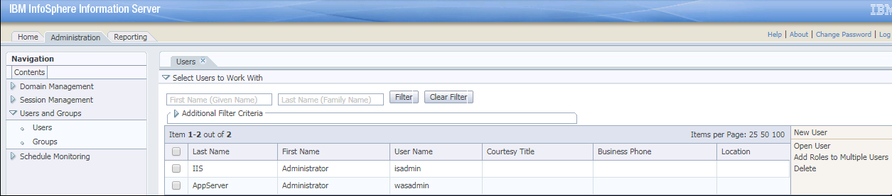

##### 图 2.新建用户页面

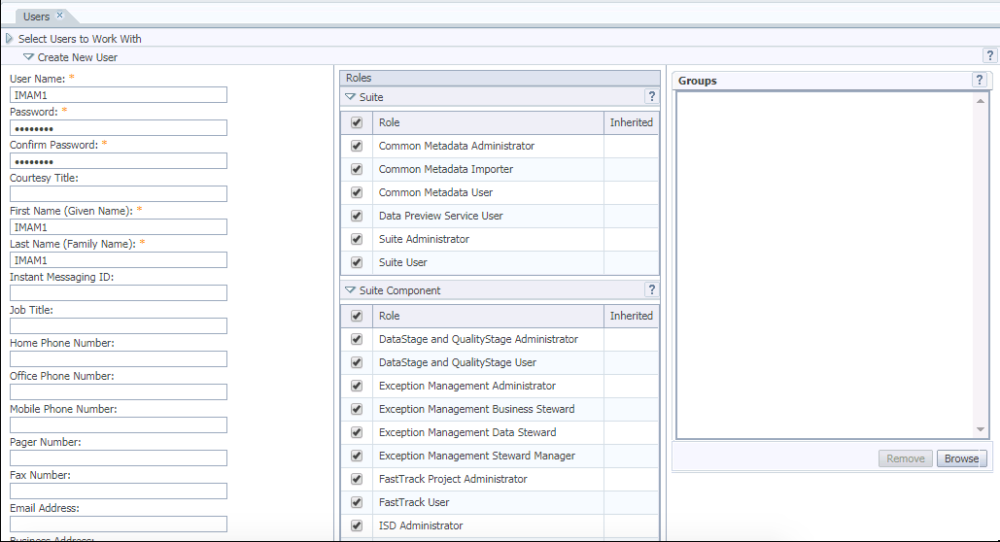

进入新建用户页面，输入用户名和密码，并选择 Roles。在这里我们赋予 IMAM 用户所有权限以确保他们都具有元数据导入权限。然后点击 “save”。这样 IMAM1 用 户就被创建成功了。同理，创建其他四个用户。创建后的页面如图 3 所 示。

##### 图 3.新建的五个 IMAM 用 户

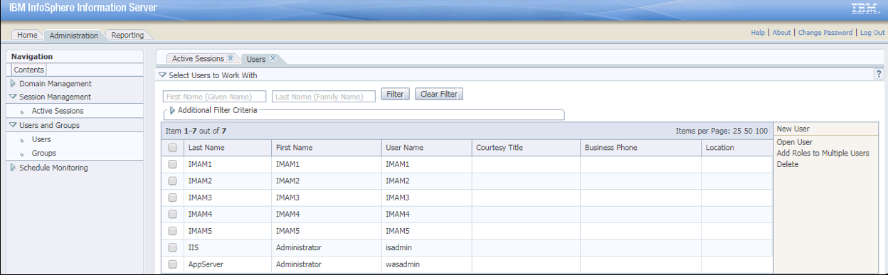

然后，我们需要添加一个 Db2 编目节点和编目数据库，这个数据库含有我们需要导入的元数据资产。登录 Information Server 的存储库层机器，切换到 db2inst1 用户。执行下面的两个命令，根据您数据库服务器和数据库的配置，将\\<parameter\\>替换成实际值即可。

```
        db2 catalog tcpip node <nodename>  remote <DBServer_IP>  server <DBServer_Port>
db2 catalog db <DBName>  at node <nodename>

```

Show moreShow more icon

添加编目成功后，我们执行命令：db2 list db directory 可以查看到新添加的编目数据库。例如图 4 中的第三个数据库。

##### 图 4.添加成功的编目数据库

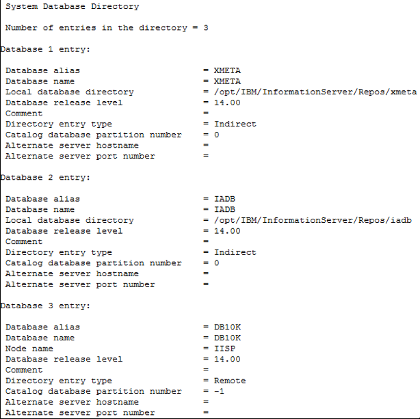

最后，准备用于 IMAM 命令行导入的 xml 文 件。我们需要先创建一个导入域。登录 IMAM 页 面，点击”New Import Area”，页面如图 5 。输入导入域的名称，选择 I BM 文 件夹下面的”IBM InfoSphere DB2 Connector”。点击”Next”进入选择数据连接页面，如图 6 所 示。

##### 图 5 .新建导入域页面

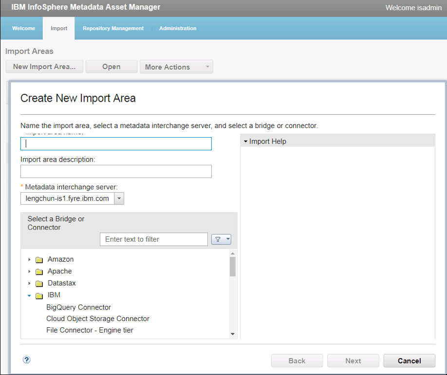

点击图 6 “Data Connection”右侧的选择数据连接图标，弹出一个新建数据连接页面如图 7 所 示。

##### 图 6.选择数据连接页面

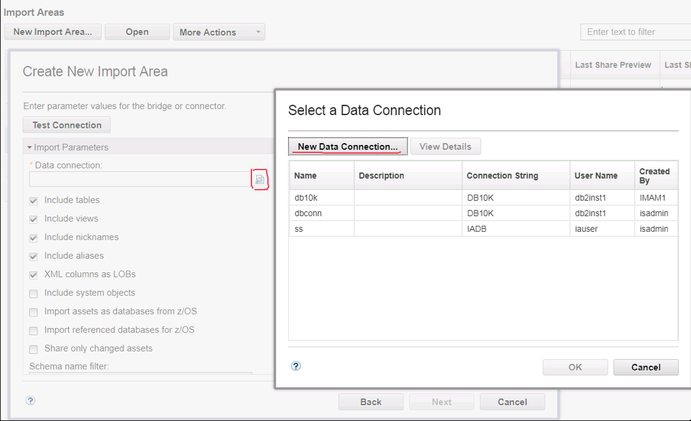

##### 图 7.新建数据连接页面


在新建数据连接页面，输入数据连接的名称。在 “Database/Location” 下拉列表中选择添加的编目数据库。输入编目数据库的用户名和密码并勾选 “Save Password”，点击 “ok” 后进入选择导入资产页面，如图 8 所 示。点击图 8 中 “Assets to import” 右侧的按钮，弹出资产选择窗口。选择需要导入的资产，然后点击 “Next”。在下一个页面选择 “Host system name”，然后点击 “Next”。选择 “Express import”，点击 Import 按钮并等待导入完成。

##### 图 8.选择导入资产

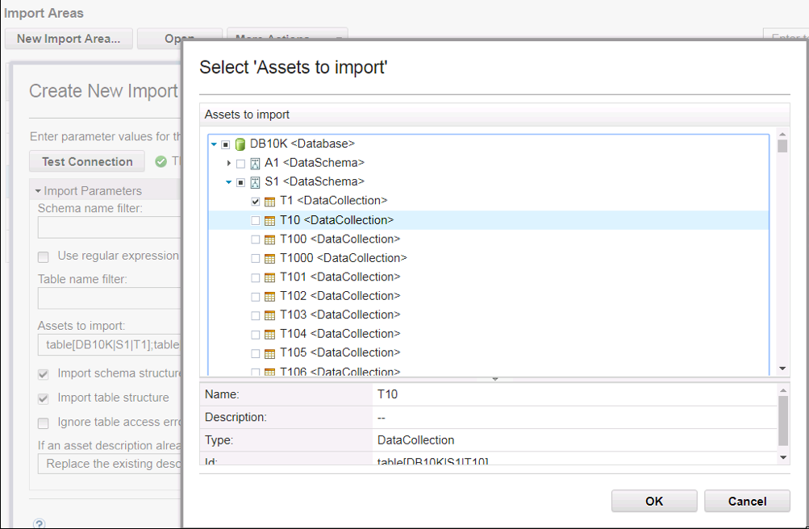

导入完成后，选中 Import Areas 下的新创建的导入域，点击 Open 按钮。进入 Staged Imports 后 ，点击 More Actions 下 “Save Parameters File”，xml 文件被导出。具体操作如图 9 所 示。

##### 图 9.导出 xml 参数文件

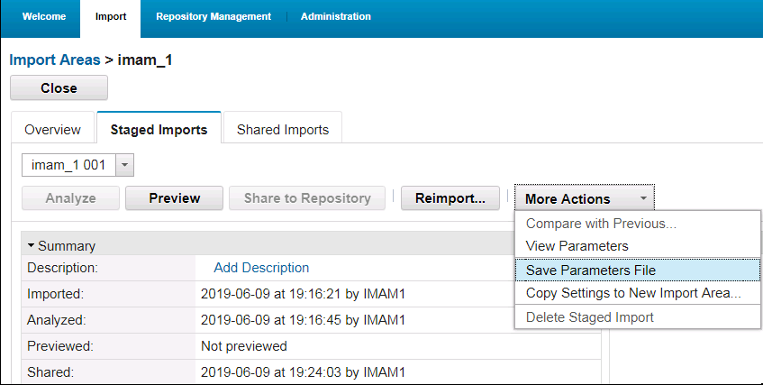

打开导出的 XML 文件，我们需要注意两点：

1. 需要添加数据库用户的密码


    ```
    <Parameter displayName="Password" id="Password">
         <value>password</value>
    </Parameter>

    ```


    Show moreShow more icon

2. 通过修改参数，来增加或减少需要导入的元数据资产。我们可以修改 之间的值，来更改需要导入的元数据资产。如果值为空，则导入数据库下的所有资产。


    ```
    <Parameter displayName="Assets to import" id="AssetsToImport">
    <value>table[DB10K|S1|T1]</value>
    </Parameter>

    ```


    Show moreShow more icon


## IMAM 并发导入测试

本文为简单起见，在测试中五个用户并发导入相同的资产。所以在准备阶段，我们只添加一个编目数据库和生成一个 xml 文件。在实际使用中，我们需要根据要导入的资产情况来添加多个编目数据库和生成多个 xml 文件。至此，准备工作都已完成。我们可以开始 IMAM 命令行的并发导入了。

打用 putty 进入 Information Server 的服务层机器。因为我们需要五个用户并发导入。所以需要使用五个 putty 窗口。每个窗口执行下面的一个导入操作。我们要在五个窗口，依次快速完成命令行的启动任务。具体命令如清单 1 所示。

### 清单 1\. IMAM 并发导入命令行

```
date; time /opt/IBM/InformationServer/ASBNode/bin/imam.sh --action import  --username imam1 --password  temp4now  -i imam_1  -mn <metadata interchange server name> -pf /data/ImportParam_1.xml

date; time /opt/IBM/InformationServer/ASBNode/bin/imam.sh --action import  --username imam2 --password  temp4now  -i imam_2  -mn <metadata interchange server name> -pf /data/ImportParam_1.xml

date; time /opt/IBM/InformationServer/ASBNode/bin/imam.sh --action import  --username imam3 --password  temp4now  -i imam_3  -mn <metadata interchange server name> -pf /data/ImportParam_1.xml

date; time /opt/IBM/InformationServer/ASBNode/bin/imam.sh --action import  --username imam4 --password  temp4now  -i imam_4  -mn <metadata interchange server name> -pf /data/ImportParam_1.xml

date; time /opt/IBM/InformationServer/ASBNode/bin/imam.sh --action import  --username imam5 --password  temp4now  -i imam_5  -mn  <metadata interchange server name> -pf /data/ImportParam_1.xml

```

Show moreShow more icon

## 禁用 chunky 导入模式的并发测试

IMAM 默认情况下开启 chunky 导入模式，我们需要先使用下面命令关闭 chunky 导入模式。然后执行上面的五个命令来获得禁用 chunky 导 入模式的并发测试结果。

```
/opt/IBM/InformationServer/ASBServer/bin/iisAdmin.sh -set -key mmi.admin.import.enableChunkyImport -value false

```

Show moreShow more icon

下面是禁用 chunky 导入模式的测试结果。我们从测试结果可以看出五个用户并发导入 140k db2 资 产：分别使用了 9 分 49 秒 ，10 分 45 秒 ，11 分 30 秒 ，12 分 17 秒 ，13 分 14 秒完成导入。如图 10，图 11，图 12，图 13 和 图 14 所 示。在/opt/IBM/WebSphere/AppServer/profiles/InfoSphere/logs/server1 下 ，执行 grep rerun \*.log\|wc -l 命令，我们可以获取到 rerun 出现的次数 40。Rerun 的次数除以 2 就是我们导入过程中尝试共享的总次数。因为一次共享失败警告信息会有两次 rerun 出现，所以需要除以 2 。因此我们的并发测试中重试共享 20 次 。

##### 图 10.IMAM3 用户导入结果（最快）


##### 图 11.IMAM2 用户导入结果


##### 图 12.IMAM4 用户导入结果


##### 图 13.IMAM5 用户导入结果

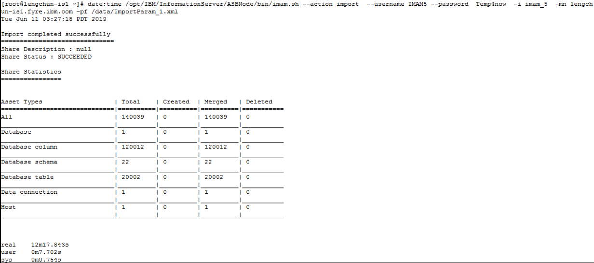

##### 图 14.IMAM3 用户导入结果（最慢）


## 启用 chunky 导入模式的并发测试

执行完禁用 chunky 导入模式的测试后，我们需要执行下面的命令来启用 chunky 导入模式。

```
/opt/IBM/InformationServer/ASBServer/bin/iisAdmin.sh -set -key mmi.admin.import.enableChunkyImport -value true

```

Show moreShow more icon

下面是启用 chunky 导 入模式的测试结果。我们从测试结果可以看出五个用户并发导入 140k db2 资 产：分别使用了 8 分 28 秒 ，9 分 8 秒 ，9 分 31 秒 ，10 分 3 秒 ，10 分 29 秒 完成导入。重试共享 20 次 。如图 15，图 16，图 17，图 18 和 图 19 所 示。

##### 图 15.IMAM1 用户导入结果（最快）

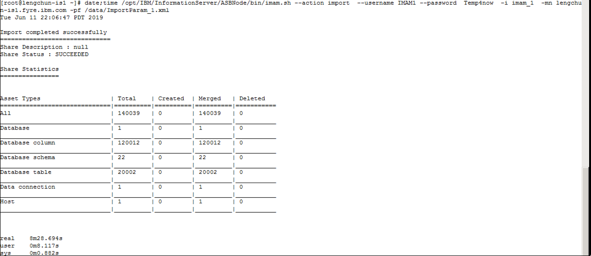

##### 图 16.IMAM3 用户导入结果

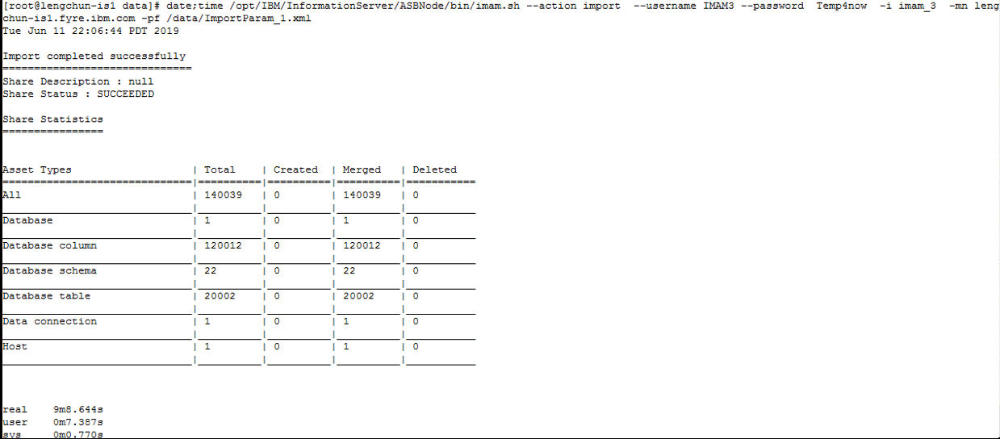

##### 图 17.IMAM4 用户导入结果


##### 图 18.IMAM2 用户导入结果


##### 图 19.IMAM5 用 户导入结果（最慢）


如果开启 chunky 导入模式，我们在/opt/IBM/WebSphere/AppServer/profiles/InfoSphere/logs/server1/SystemOut.log

中可以看到”Performing chunky import”字样，这表明已开启 chunky 导 入模式。

```
""[6/8/19 16:29:31:852 PDT] 00000179 ImportHandler I   Skipping the preview during this express import.
[6/8/19 16:29:31:868 PDT] 00000179 ImportEventCl I   populateShareEventFromImportEvent start for :ImportEvent[ku4mmebbh.ec0in4d.hq8erk.4t06n1ohbkpj2oiiofl9puda]
[6/8/19 16:29:37:940 PDT] 00000182 ImportEventCl I   Performing chunky import.
[6/8/19 16:29:46:168 PDT] 00000180 ImportEventCl I   Performing chunky import.
[6/8/19 16:29:46:785 PDT] 00000184 ImportEventCl I   Performing chunky import.
[6/8/19 16:29:50:799 PDT] 00000187 ImportEventCl I   Performing chunky import.
[6/8/19 16:29:53:019 PDT] 00000179 ImportEventCl I   Performing chunky import.
[6/8/19 16:31:53:573 PDT] 00000180 UpdateByRidCo E   DataStageX.DSStageType instance(s)”。

```

Show moreShow more icon

## 禁用/启用 chunky 导 入模式的并发测试结果分析

五个用户分别使用 IMAM 并发导入 140k db2 资产，两种模式都重试了 20 次 。两种模式下，五个用户使用的时间分别如下：

禁用 chunky 导入模式： 9 分 49 秒 ，10 分 45 秒 ，11 分 30 秒 ，12 分 17 秒 ，13 分 14 秒

启用 chunky 导入模式： 8 分 28 秒 ， 9 分 8 秒 ， 9 分 31 秒 ， 10 分 3 秒 ， 10 分 29 秒

从上面的结果可以看出，启用 chunky 导入模式后，并发导入性能有了很好的提高。此次对比分析实验中，我们仅导入了少量的资产，但已经获得了明显的性能提高。在大数据量的资产导入中，还会有更显著的性能提升。在实际使用中，我们可以设置 chunky 导入模式的块数量为不同的值，通过测试来获得适合我们环境的最佳值。

## 常见问题的解决

导入大数据量的资产时，我们需要调整一些特定参数的默认值，从而避免导入操作遇到参数限制而意外终止。

### 增加 x meta 的 LOGFILSIZ 参 数

我们在使用 IMAM 导 入大数据量的资产时，可能会遇到如清单 2 所示的 xmeta 数 据库死锁错误。

### 清单 2.xmeta 数据库死锁错误

```
"[1/9/19 18:43:18:058 PST] 00000193 UpdateByRidCo E Batch error saving ASCLModel.HostSystem: [0:b1c497ce.354f5217.dsemfnka6.u4i8atr.muoe1s.h07hc037jfd66mgg2iva0]
[1/9/19 18:43:18:060 PST] 00000193 PersistenceUt E Deadlock has caused transaction rollback
com.ibm.db2.jcc.am.SqlTransactionRollbackException: Error for batch element #1: DB2 SQL Error: SQLCODE=-1476, SQLSTATE=40506, SQLERRMC=-911, DRIVER=3.71.22
at com.ibm.db2.jcc.am.gd.a(gd.java:800)
at com.ibm.db2.jcc.am.gd.a(gd.java:66)
at com.ibm.db2.jcc.am.gd.a(gd.java:140)
at com.ibm.db2.jcc.am.gp.c(gp.java:2788)
[1/9/19 18:43:18:083 PST] 00000193 RepositoryMet E Error executing saveAndDeleteEObjects_251: A database deadlock has occurred
[1/9/19 18:43:18:084 PST] 00000193 AssetImportCl E Error importing asset
com.ibm.iis.xmeta.client.exception.data.DatabaseDeadlockException: A database deadlock has occurred
...”。

```

Show moreShow more icon

如果出现上面的异常，我们就需要增加 xmeta 数据库的 LOGFILSIZ。操作如下：

```
db2 UPDATE DATABASE CONFIGURATION FOR xmeta USING LOGFILSIZ 250000;

```

Show moreShow more icon

### 增加 ISF 代理的 jave heap space

在我们使用 IMAM 导入大数据量的资产时，可能会遇到下面的异常信息：

```
"Caused by: java.lang.OutOfMemoryError: Java heap space
at java.lang.StringBuilder.ensureCapacityImpl(StringBuilder.java:754)
at java.lang.StringBuilder.append(StringBuilder.java:544)
at java.lang.StringBuilder.append(StringBuilder.java:497)
at com.ibm.iis.isf.agent.Response.toString(Response.java:141)
..."。

```

Show moreShow more icon

这表明我们需要增加 ISF agent 的 java heap space。具体的修改步骤如下：

首先，备份/opt/IBM/InformationServer/ASBNode/bin/Agent.sh

然后，vi /opt/IBM/InformationServer/ASBNode/bin/Agent.sh,并找到以”eval exec ‘”${JAVA\_HOME}/bin/java”‘”开头，且以”com.ibm.iis.isf.agent.impl.AgentImpl ‘”$@”‘”为结尾的行。我们可以看到，这行包含一些以-X 为开头的参数，例如 -Xss2M -Xoss2M。我们在 -X 附近增加

-Xmx\\<maxheapsize\\>，默认情况下该值为 512M。 如果我们将它增加到 1GB，则写成 -Xmx1024M。修改完参数后，我们需要重新启动 NodeAgents.sh 和 MetadataServer.sh 。步骤如下：

```
/opt/IBM/InformationServer/ASBNode/bin/NodeAgents.sh stop
/opt/IBM/InformationServer/ASBServer/bin/MetadataServer.sh stop
/opt/IBM/InformationServer/ASBServer/bin /MetadataServer.sh run
/opt/IBM/InformationServer/ASBNode/bin/NodeAgents.sh start

```

Show moreShow more icon

## 总结

本文详细讲解了 Information Server 产品中 IMAM 组 件的块导入的使用方法，通过实例对启用和禁用 chunky 导入模式进行对比分析，从何帮助客户理解 chunky 导入特性及如何更好的使用它。同时列举出实践中经常会遇到的一些问题，并给出解决方法。

## 参考资源

- [IBM InfoSphere Information Server Version 11.7.1 documentation](https://www.ibm.com/support/knowledgecenter/SSZJPZ_11.7.0/com.ibm.swg.im.iis.productization.iisinfsv.home.doc/topics/kc_homepage_IS.html)
- [Configuration parameters for database logging](https://www.ibm.com/support/knowledgecenter/en/SSEPGG_11.1.0/com.ibm.db2.luw.admin.ha.doc/doc/r0006082.html)
- [How do you increase the Java heap space for the ISF agent?](https://www-01.ibm.com/support/docview.wss?uid=swg22002104)