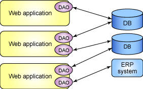
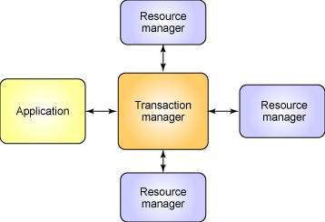

# 高级 DAO 编程
学习编译更好的 DAO 的技巧

**标签:** Java

[原文链接](https://developer.ibm.com/zh/articles/j-dao/)

Sean C. Sullivan

发布: 2003-10-15

* * *

## 前言

在过去 18 个月中，我参加了一个由有才华的软件工程师组成的小组，构建定制的、基于 Web 的供应链管理应用程序。我们的应用程序访问范围广泛的持久性数据，包括配送状态、供应链衡量(metrics)、库存、货运发票、项目管理数据和用户信息。我们用 JDBC API 连接到我们公司的不同数据库平台上，并在整个应用程序中使用 DAO 设计模式。

图 1 显示了应用程序和数据源之间的关系：

##### 图 1\. 应用程序和数据源



在整个应用程序中使用数据访问对象(DAO)使我们可以将底层数据访问逻辑与业务逻辑分离开来。我们构建了为每一个数据源提供 GRUD (创建、读取、更新、删除)操作的 DAO 类。

在本文中，我将为您介绍构建更好的 DAO 类的 DAO 实现策略和技术。更确切地说，我将讨论日志、异常处理和事务界定。您将学到如何将这三者结合到自己的 DAO 类中。本文假定您熟悉 JDBC API、SQL 和关系数据库编程。

我们将以对 DAO 设计模式和数据访问对象的概述开始。

## DAO基础

DAO 模式是标准 J2EE 设计模式之一。开发人员用这种模式将底层数据访问操作与高层业务逻辑分离开。一个典型的 DAO 实现有以下组件：

- 一个 DAO 工厂类
- 一个 DAO 接口
- 一个实现了 DAO 接口的具体类
- 数据传输对象(有时称为值对象)

具体的 DAO 类包含访问特定数据源的数据的逻辑。在下面一节中您将学习设计和实现数据访问对象的技术。有关 DAO 设计模式的更多内容请参阅 参考资料 。

## 事务界定

关于 DAO 要记住的重要一点是它们是事务性对象。由 DAO 所执行的每一个操作 — 如创建、更新或者删除数据 — 都与一个事务相关联。因此， _事务界定_ 的概念就变得特别重要了。

事务界定是定义事务边界的方式。J2EE 规范描述了两种事务界定的模型：编程式(programmatic)和声明式(declarative)。表 1 分析了这两种模型：

##### 表 1\. 两种事务界定的模型

声明式事务界定编程式事务界定程序员用 EJB 部署描述符声明事务属性。程序员负责编写事务逻辑。运行时环境(EJB 容器)用这些属性自动管理事务。应用程序通过一个 API 控制事务。

我们将侧重于编程式事务界定。

### 设计考虑

如前所述，DAO 是事务性对象。一个典型的 DAO 执行像创建、更新和删除这样的事务性操作。在设计 DAO 时，首先要问自己以下问题：

- 事务要如何开始？
- 事务应如何结束？
- 哪一个对象将负责开始一个事务？
- 哪一个对象将负责结束一个事务？
- DAO 是否要负责事务的开始和结束？
- 应用程序是否需要通过多个 DAO 访问数据？
- 事务涉及到一个 DAO 还是多个 DAO？
- 一个 DAO 是否调用另一个 DAO 的方法？

了解上述问题的答案将有助于您选择最适合的 DAO 的事务界定策略。在 DAO 中有两种主要的界定事务的策略。一种方式是让 DAO 负责界定事务，另一种将事务界定交给调用这个 DAO 方法的对象处理。如果选择了前一种方式，那么就将事务代码嵌入到 DAO 中。如果选择后一种方式，那么事务界定代码就是在 DAO 类外面。我们将使用简单的代码示例帮助您更好理解每一种方式是如何工作的。

清单 1 显示了一个有两种数据操作的 DAO：创建和更新：

##### 清单 1\. DAO 方法

```
public void createWarehouseProfile(WHProfile profile);
       public void updateWarehouseStatus(WHIdentifier id, StatusInfo status);

```

Show moreShow more icon

清单 2 显示了一个简单的事务。事务界定在 DAO 类外面。注意在这个例子中调用者是如何在一个事务中结合多个 DAO 操作的。

##### 清单 2\. 调用者管理的事务

```
tx.begin();    // start the transaction
      dao.createWarehouseProfile(profile);
      dao.updateWarehouseStatus(id1, status1);
      dao.updateWarehouseStatus(id2, status2);
      tx.commit();   // end the transaction

```

Show moreShow more icon

这种事务界定策略对于需要在一个事务中访问多个 DAO 的应用程序特别有用。

可以用 JDBC API 或者 Java 事务 API(Java Transaction API JTA)实现事务界定。 JDBC 事务界定比 JTA 事务界定要简单，但是 JTA 提供了更多的灵活性。在下面一节中我将更深入地分析事务界定的机制。

## 用 JDBC 进行事务界定

JDBC 事务是用 `Connection` 对象控制的。JDBC Connection 接口(`java.sql.Connection`)提供了两种事务模式：自动提交和手工提交。 `java.sql.Connection` 提供了以下控制事务的方法：

- `public void setAutoCommit(boolean)`
- `public boolean getAutoCommit()`
- `public void commit()`
- `public void rollback()`

清单 3 显示了如何用 JDBC API 界定一个事务：

##### 清单 3\. 用 JDBC API 进行事务界定

```
import java.sql.*;
      import javax.sql.*;
      // ...
      DataSource ds = obtainDataSource();
      Connection conn = ds.getConnection();
      conn.setAutoCommit(false);
      // ...
      pstmt = conn.prepareStatement("UPDATE MOVIES ...");
      pstmt.setString(1, "The Great Escape");
      pstmt.executeUpdate();
      // ...
      conn.commit();
      // ...

```

Show moreShow more icon

使用 JDBC 事务界定时，您可以将多个 SQL 语句结合到一个事务中。JDBC 事务的一个缺点是事务的范围局限于一个数据库连接。一个 JDBC 事务不能跨越多个数据库。在下面，我们将看一下如何用 JTA 进行事务界定。因为 JTA 不像 JDBC 那样有名，所以我们首先做一个简介。

## JTA简介

Java 事务 API(JTA) 及其同门兄弟 Java 事务服务(Java Transaction Service JTS)为 J2EE 平台提供了分布式事务服务。一个 _分布式的事务_ 涉及一个事务管理器和一个或者多个资源管理器。一个 _资源管理器_ 是任何类型的持久性的数据存储。事务管理器负责协调所有事务参与者之间的通信。事务管理器与资源管理器之间的关系如图 2 所示：

##### 图 2\. 一个事务管理器和资源管理器



JTA 事务比 JDBC 事务功能更强。JDBC 事务局限为一个数据库连接，而 JTA 事务可以有多个参与者。所有下列 Java 平台组件都可以参与 JTA 事务：

- JDBC 连接
- JDO `PersistenceManager` 对象
- JMS 队列
- JMS 主题
- 企业 JavaBeans
- 符合 J2EE 连接体系结构(J2EE Connector Architecture)规范的资源适配器

## 使用 JTA 的事务界定

要用 JTA 进行事务界定，应用程序要调用 `javax.transaction.UserTransaction` 接口中的方法。清单 4 显示了对 `UserTransaction` 对象的典型 JNDI 查询：

##### 清单 4\. 一个对 UserTransaction 对象的 JDNI 查询

```
import javax.transaction.*;
      import javax.naming.*;
      // ...
      InitialContext ctx = new InitialContext();
      Object txObj = ctx.lookup("java:comp/UserTransaction");
      UserTransaction utx = (UserTransaction) txObj;

```

Show moreShow more icon

当应用程序找到了 `UserTransaction` 对象后，就可以开始事务了，如清单 5 所示：

##### 清单 5\. 用 JTA 开始一个事务

```
utx.begin();
      // ...
      DataSource ds = obtainXADataSource();
      Connection conn = ds.getConnection();
      pstmt = conn.prepareStatement("UPDATE MOVIES ...");
      pstmt.setString(1, "Spinal Tap");
      pstmt.executeUpdate();
      // ...
      utx.commit();
      // ...

```

Show moreShow more icon

当应用程序调用 `commit()` 时，事务管理器用一个两阶段的提交协议结束事务。

## 控制事务的 JTA 方法

`javax.transaction.UserTransaction` 接口提供了以下事务控制方法：

- `public void begin()`
- `public void commit()`
- `public void rollback()`
- `public int getStatus()`
- `public void setRollbackOnly()`
- `public void setTransactionTimeout(int)`

应用程序调用 `begin()` 开始事务。应用程序调用 `commit()` 或者 `rollback()` 结束事务。参阅 参考资料 以了解更多关于用 JTA 进行事务管理的内容。

## 使用 JTA 和 JDBC

开发人员通常在 DAO 类中用 JDBC 进行底层数据操作。如果计划用 JTA 界定事务，那么就需要有一个实现 `javax.sql.XADataSource` 、 `javax.sql.XAConnection` 和 `javax.sql.XAResource` 接口的 JDBC 驱动程序。一个实现了这些接口的驱动程序将可以参与 JTA 事务。一个 `XADataSource` 对象就是一个 `XAConnection` 对象的工厂。 `XAConnection`s 是参与 JTA 事务的 JDBC 连接。

您将需要用应用服务器的管理工具设置 `XADataSource` 。从应用服务器和 JDBC 驱动程序的文档中可以了解到相关的指导。

J2EE 应用程序用 JNDI 查询数据源。一旦应用程序找到了数据源对象，它就调用 `javax.sql.DataSource.getConnection()` 以获得到数据库的连接。

XA 连接与非 XA 连接不同。一定要记住 XA 连接参与了 JTA 事务。这意味着 XA 连接不支持 JDBC 的自动提交功能。同时，应用程序一定不要对 XA 连接调用 `java.sql.Connection.commit()` 或者 `java.sql.Connection.rollback()` 。相反，应用程序应该使用 `UserTransaction.begin()、 UserTransaction.commit()` 和 `serTransaction.rollback()` 。

## 选择最好的方式

我们讨论了如何用 JDBC 和 JTA 界定事务。每一种方式都有其优点，您需要决定哪一种最适合于您的应用程序。

在最近的许多项目中，我们小组是用 JDBC API 进事务界定来构建 DAO 类的。这些 DAO 类可以总结如下：

- 事务界定代码嵌入在 DAO 类中。
- DAO 类使用 JDBC API 进行事务界定。
- 调用者不能界定事务。
- 事务范围局限于单个 JDBC 连接。

JDBC 事务并不总是适合复杂的企业应用程序。如果您的事务要跨越多个 DAO 或者多个数据库，那么下列实现策略也许更合适：

- 事务用 JTA 界定。
- 事务界定代码从 DAO 中分离出来。
- 调用者负责界定事务。
- DAO 加入一个全局事务。

JDBC 方式由于其简单性而具有吸引力，JTA　方式提供了更大的灵活性。您所选择的实现将取决于应用程序的特定需求。

## 日志记录和 DAO

一个良好实现的 DAO 类将使用日志记录来捕捉有关其运行时行为的细节。您可以选择记录异常、配置信息、连接状态、JDBC 驱动程序元数据、或者查询参数。日志对于开发的所有阶段都很有用。我经常在开发时、测试时和生产中分析应用程序日志。

在本节，我将展示一个显示如何将 Jakarta Commons Logging 加入到 DAO 中的代码示例。在这之前，让我们回顾一下一些基本知识。

### 选择日志库

许多开发人员使用一种原始格式进行日志记录： `System.out.println` 和 `System.err.println` 。 `Println` 语句速度快且使用方便，但是它们没有提供全功能的日志记录系统所具有的功能。表 2 列出了 Java 平台的日志库：

##### 表 2\. Java 平台的日志库

日志库开放源代码？URLjava.util.logging不是`http://java.sun.com/j2se/`Jakarta Log4j是`http://jakarta.apache.org/log4j/`Jakarta Commons Logging是`http://jakarta.apache.org/commons/logging.html`

Jakarta Commons Logging 可以与 `java.util.logging` 或者 Jakarta Log4j 一同使用。Commons Logging 是一个日志抽象层，它隔离了应用程序与底层日志实现。使用 Commons Logging，您可以通过改变配置文件更换底层日志实现。Commons Logging 在 Jakarta Struts 1.1 和 Jakarta HttpClient 2.0 中使用。

### 一个日志记录示例

清单 7 显示了如何在 DAO 类中使用 Jakarta Commons Logging：

##### 清单 7\. DAO 类中的 Jakarta Commons Logging

```
import org.apache.commons.logging.*;
class DocumentDAOImpl implements DocumentDAO
{
      static private final Log log = LogFactory.getLog(DocumentDAOImpl.class);
      public void deleteDocument(String id)
      {
          // ...
          log.debug("deleting document: " + id);
          // ...
          try
          {
              // ... data operations ...
          }
          catch (SomeException ex)
          {
              log.error("Unable to delete document", ex);
              // ... handle the exception ...
    }
      }
}

```

Show moreShow more icon

日志记录是所有任务关键型应用程序的重要部分。如果在 DAO 中遇到故障，那么日志通常可以提供判断出错位置的最好信息。将日志加入到 DAO 可以保证您有机会进行调试和故障排除。

## DAO 中的异常处理

我们讨论过了事务界定和日志，现在对于如何在数据访问对象上应用它们有了更深入的理解。我们的第三个和最后一个讨论议题是异常处理。遵从几个简单的异常处理指导可以使您的 DAO 更容易使用、更健壮及更易于维护。

在实现 DAO 模式时，考虑以下问题：

- DAO 的公共接口中的方法是否抛出检查过的异常？
- 如果是的话，抛出何种检查过的异常？
- 在 DAO 实现类中如何处理异常？

在使用 DAO 模式的过程中，我们的小组开发了一些处理异常的原则。遵从这些原则可以极大地改进您的 DAO：

- DAO 方法应该抛出有意义的异常。
- DAO 方法不应该抛出 `java.lang.Exception` 。 `java.lang.Exception` 太一般化了。它不传递关于底层问题的任何信息。
- DAO 方法不应该抛出 `java.sql.SQLException` 。SQLException 是一个低级别的 JDBC 异常。一个 DAO 应该力争封装 JDBC 而不是将 JDBC 公开给应用程序的其余部分。
- 只有在可以合理地预期调用者可以处理异常时，DAO 接口中的方法才应该抛出检查过的异常。如果调用者不能以有意义的方式处理这个异常，那么考虑抛出一个未检查的(运行时)异常。
- 如果数据访问代码捕获了一个异常，不要忽略它。忽略捕获的异常的 DAO 是很难进行故障诊断的。
- 使用链接的异常将低级别的异常转化为高级别的异常。
- 考虑定义标准 DAO 异常类。Spring Framework (参阅 参考资料)提供了很好的一套预定义的 DAO 异常类。

有关异常和异常处理技术的更多信息参阅 参考资料 。

## 实现实例： MovieDAO

`MovieDAO` 是一个展示本文中讨论的所有技术的 DAO：事务界定、日志和异常处理。您可以在 参考资料 一节中找到 `MovieDAO` 源代码。代码分为三个包：

- `daoexamples.exception`
- `daoexamples.movie`
- `daoexamples.moviedemo`

DAO 模式的这个实现包含下面列出的类和接口：

- `daoexamples.movie.MovieDAOFactory`
- `daoexamples.movie.MovieDAO`
- `daoexamples.movie.MovieDAOImpl`
- `daoexamples.movie.MovieDAOImplJTA`
- `daoexamples.movie.Movie`
- `daoexamples.movie.MovieImpl`
- `daoexamples.movie.MovieNotFoundException`
- `daoexamples.movie.MovieUtil`

`MovieDAO` 接口定义了 DAO 的数据操作。这个接口有五个方法，如下所示：

- `public Movie findMovieById(String id)`
- `public java.util.Collection findMoviesByYear(String year)`
- `public void deleteMovie(String id)`
- `public Movie createMovie(String rating, String year, String, title)`
- `public void updateMovie(String id, String rating, String year, String title)`

`daoexamples.movie` 包包含 `MovieDAO` 接口的两个实现。每一个实现使用一种不同的方式进行事务界定，如表 3 所示：

##### 表 3\. MovieDAO 实现

MovieDAOImplMovieDAOImplJTA实现 MovieDAO 接口?是是通过 JNDI 获得 DataSource？是是从 DataSource 获得 java.sql.Connection 对象？是是DAO 在内部界定事务？是否使用 JDBC 事务？是否使用一个 XA DataSource？否是参与 JTA 事务？否是

### MovieDAO 演示应用程序

这个演示应用程序是一个名为 `daoexamples.moviedemo.DemoServlet` 的 servlet 类。 `DemoServlet` 使用这两个 Movie DAO 查询和更新表中的电影数据。

这个 servlet 展示了如何将支持 JTA 的 `MovieDAO` 和 Java 消息服务(Java Message Service)结合到一个事务中，如清单 8 所示。

##### 清单 8\. 将 MovieDAO 和 JMS 代码结合到一个事务中

```
UserTransaction utx = MovieUtil.getUserTransaction();
    utx.begin();
    batman = dao.createMovie("R",
            "2008",
            "Batman Reloaded");
    publisher = new MessagePublisher();
    publisher.publishTextMessage("I'll be back");
    dao.updateMovie(topgun.getId(),
            "PG-13",
            topgun.getReleaseYear(),
            topgun.getTitle());
    dao.deleteMovie(legallyblonde.getId());
    utx.commit();

```

Show moreShow more icon

要运行这个演示应用程序，需要在应用服务器上配置一个 XA 数据源和一个非 XA 数据源。然后，部署 daoexamples.ear 文件。这个应用程序可以在任何兼容 J2EE 1.3 的应用服务器上运行。参阅 参考资料 以获得 EAR 文件和源代码。

## 结束语

正如本文所展示的，实现 DAO 模式需要做比编写低级别的数据访问代码更多的工作。现在，通过选择一个适合您的应用程序的事务界定策略、通过在 DAO 类中加入日志记录，以及通过遵从几项简单的异常处理原则，您可以构建更好的 DAO。

本文翻译自： [Advanced DAO programming](https://www.ibm.com/developerworks/library/j-dao/index.html)（2003-10-07）